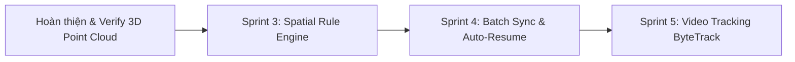

# 📋 DANH MỤC TÍNH NĂNG ĐỀ XUẤT NÂNG CẤP V2 (FEATURE BACKLOG)
> **Dự án:** Locate-Anything (Universal AI Auto-Labeling for CVAT)  
> **Tài liệu tham chiếu:** Kế hoạch tính năng tương lai sau khi hoàn thiện 3D Point Cloud  
> **Trạng thái:** *Đã phân tích kỹ thuật & Lưu trữ thực hiện sau (Deferred for Future Sprints)*

---

## 📌 MỤC LỤC
1. [Bảng Đánh Giá & Ma Trận Ưu Tiên](#1-bảng-đánh-giá--ma-trận-ưu-tiên)
2. [Tính Năng 1: Spatial Rule Engine (Che khuất, Cắt cụt, Lọc rác & Màu xe)](#2-tính-năng-1-spatial-rule-engine)
3. [Tính Năng 2: Video Multi-Object Tracking (Chuỗi đối tượng `tracks` với ByteTrack)](#3-tính-năng-2-video-multi-object-tracking)
4. [Tính Năng 3: Batching & Fault-Tolerance Sync (Upload lũy tiến & Auto-Resume)](#4-tính-năng-3-batching--fault-tolerance-sync)
5. [Tính Năng 4: Interactive Controls Trên Colab UI (Confidence Slider & Whitelist)](#5-tính-năng-4-interactive-controls-trên-colab-ui)
6. [Lộ Trình Triển Khai Khuyến Nghị](#6-lộ-trình-triển-khai-khuyến-nghị)

---

## 1. Bảng Đánh Giá & Ma Trận Ưu Tiên

| Thứ tự | Tính năng đề xuất | Giá trị thực tế cho Annotator | Độ phức tạp | Tài nguyên GPU / CPU | Trọng số khuyến nghị |
| :---: | :--- | :--- | :---: | :---: | :---: |
| **P1** | **Spatial Rule Engine** (`occluded`, `truncated`, color) | ⭐⭐⭐⭐⭐ (Tránh bị phạt lỗi QC do quên tick tay) | Thấp (Toán học thuần) | Thuần CPU, 0MB GPU | **Khuyên làm đầu tiên** |
| **P2** | **Batching & Auto-Resume** (Chống rớt mạng Colab) | ⭐⭐⭐⭐⭐ (Không bao giờ mất kết quả task lớn) | Trung bình | Thuần I/O Python | **Cần thiết cho Colab Free** |
| **P3** | **Video Multi-Object Tracking** (`tracks` payload) | ⭐⭐⭐⭐ (Giữ track_id liên tục qua video) | Trung bình | Tích hợp ByteTrack | **Rất tốt cho video** |
| **P4** | **Colab UI Flexible Controls** (Slider, Whitelist) | ⭐⭐⭐ (Dễ dùng, không cần sửa code Python) | Thấp | 0 overhead | **Làm khi hoàn thiện UI** |

---

## 2. Tính Năng 1: Spatial Rule Engine

### 2.1. Vấn đề thực tế
Khi kiểm tra chất lượng (QC) trên CVAT:
- Annotator thường bị trừ điểm nặng do **quên tick cờ `occluded`** (đối tượng bị xe/cây cối che khuất một phần).
- Annotator **quên gán cờ `truncated`** khi một phần thân xe/người bị cắt cụt ở rìa mép ảnh.
- AI sinh ra các hộp nhỏ li ti ở đường chân trời (dưới $15\times 15\text{px}$) gây nhiễu.
- Không tự động điền thuộc tính màu sắc xe (`vehicle_color`).

### 2.2. Thiết kế giải pháp kỹ thuật
Tạo module `server/ai_engine/rule_engine.py`:
1. **Thuật toán Occlusion (Che khuất)**:
   - Tính toán ma trận giao nhau giữa các hộp bao $\text{IoA} = \frac{\text{Intersection}(B_i, B_j)}{\min(\text{Area}(B_i), \text{Area}(B_j))}$.
   - Dựa vào tọa độ đáy $y_2$ để phân biệt vật thể đứng trước và vật thể đứng sau: Hộp có đáy $y_2$ cao hơn (nằm sâu hơn về phía chân trời) là vật thể bị che.
   - Nếu $\text{IoA} \ge 0.20$ (hoặc ngưỡng cấu hình), tự động set `occluded: true`.
2. **Thuật toán Truncation (Cắt cụt)**:
   - Kiểm tra khoảng cách từ cạnh hộp $(x_1, y_1, x_2, y_2)$ tới biên ảnh $(W, H)$:
   - Nếu $x_1 \le 2\text{px} \lor y_1 \le 2\text{px} \lor x_2 \ge (W - 2)\text{px} \lor y_2 \ge (H - 2)\text{px}$, tự động gán thuộc tính `attributes: [{"name": "truncated", "value": "true"}]`.
3. **Bộ lọc kích thước (Noise Filter)**:
   - Loại bỏ các hộp có $W < 15\text{px}$ hoặc $H < 15\text{px}$.
4. **Bộ trích xuất màu xe (Color Extraction)**:
   - Crop vùng ảnh bên trong bounding box (cắt bớt 15% viền để bỏ kính xe và bánh xe).
   - Chuyển sang không gian màu HSV và chạy $K$-Means clustering ($K=3$) để tìm màu chủ đạo: `white`, `black`, `silver`, `red`, `blue`, `yellow`.

```python
# Cấu trúc áp dụng dự kiến trong rule_engine.py
class SpatialRuleEngine:
    def __init__(self, config_path="configs/labels_config.yaml"):
        ...
    def apply_rules(self, shapes: list, image_shape: tuple) -> list:
        # 1. Filter small noise
        # 2. Check truncated on image borders
        # 3. Check occluded with IoA threshold
        # 4. Extract dominant color if attribute configured
        return processed_shapes
```

---

## 3. Tính Năng 2: Video Multi-Object Tracking

### 3.1. Vấn đề thực tế
Hiện tại hệ thống đẩy annotations lên CVAT theo mảng `shapes: [...]`.
- Trong Task dạng Video, mỗi frame vật thể lại là một hình độc lập, không có ID liên kết.
- Annotator phải thủ công nối track từng chiếc xe xuyên suốt video rất mất thời gian.

### 3.2. Thiết kế giải pháp kỹ thuật
CVAT REST API hỗ trợ đối tượng `tracks`:
```json
{
  "tracks": [
    {
      "frame": 0,
      "label_id": 1,
      "group": 0,
      "shapes": [
        {
          "frame": 0,
          "type": "rectangle",
          "points": [100.0, 150.0, 300.0, 400.0],
          "occluded": false,
          "outside": false,
          "keyframe": true,
          "z_order": 0,
          "attributes": []
        },
        {
          "frame": 1,
          "type": "rectangle",
          "points": [105.0, 152.0, 305.0, 402.0],
          "occluded": false,
          "outside": false,
          "keyframe": true,
          "z_order": 0,
          "attributes": []
        }
      ],
      "attributes": []
    }
  ]
}
```
**Triển khai:**
- Tích hợp **ByteTrack** (có sẵn qua `model.track(..., persist=True)` của Ultralytics).
- Gom các kết quả có cùng `track_id` vào chung một cấu trúc track với các keyframes.

---

## 4. Tính Năng 3: Batching & Fault-Tolerance Sync

### 4.1. Vấn đề thực tế
- Người dùng chạy Task hoặc Job lớn trên Google Colab (500 đến 3.000 frame).
- Hiện tại script phải đợi chạy xong toàn bộ 100% frame mới upload lên CVAT 1 lần.
- Nếu Colab bị disconnect ở frame thứ 800 thì **mất trắng 100% công sức chạy trước đó**.

### 4.2. Thiết kế giải pháp kỹ thuật
1. **Lũy tiến theo Batch (Chunk Upload)**:
   - Cho phép cấu hình `--batch-size 50`.
   - Cứ mỗi 50 frame suy luận xong, gọi API `PATCH /api/jobs/{id}/annotations?action=create` để lưu ngay vào CVAT.
2. **Auto-Resume Checkpoint**:
   - Ghi lại số frame vừa hoàn thành vào file `.cvat_checkpoint_{job_id}.json`.
   - Nếu bị ngắt kết nối và người dùng bấm chạy lại notebook: Hệ thống kiểm tra checkpoint và tự động chạy tiếp từ frame kế tiếp thay vì chạy lại từ frame 0.

---

## 5. Tính Năng 4: Interactive Controls Trên Colab UI

### 5.1. Vấn đề thực tế
Người dùng không rành Python muốn:
- Thay đổi độ tin cậy AI (Confidence Threshold) tùy từng video mờ hay nét.
- Chọn lọc chỉ gán nhãn 1 vài class cụ thể (ví dụ: chỉ chạy `car` và `truck`, bỏ qua `person`).

### 5.2. Thiết kế giải pháp kỹ thuật
Thêm tham số CLI vào `colab/cvat_auto_sync.py`:
- `--conf 0.4` (Ngưỡng tự tin, mặc định 0.35)
- `--include-labels car,truck` (Chỉ phát hiện các lớp được chỉ định)
- `--exclude-labels person` (Bỏ qua các lớp không muốn gán nhãn)

Cập nhật giao diện form của Colab Notebook:
```python
CONFIDENCE_THRESHOLD = 0.40  #@param {type:"slider", min:0.1, max:0.9, step:0.05}
ONLY_LABELS = "car, truck, pedestrian"  #@param {type:"string"}
```

---

## 6. Lộ Trình Triển Khai Khuyến Nghị



1. **Giai đoạn Hiện Tại (Current)**: Kiểm tra và kiểm thử hoàn chỉnh Pipeline 3D LiDAR Point Cloud (`cuboid`).
2. **Giai đoạn Kế Tiếp (Next Sprint)**: Triển khai Tính năng 1 (`rule_engine.py`) và Tính năng 3 (Batch Sync Colab) để hỗ trợ annotator tối đa.
3. **Giai đoạn Mở Rộng**: Triển khai Video Tracking (`tracks`) và Colab UI controls.
