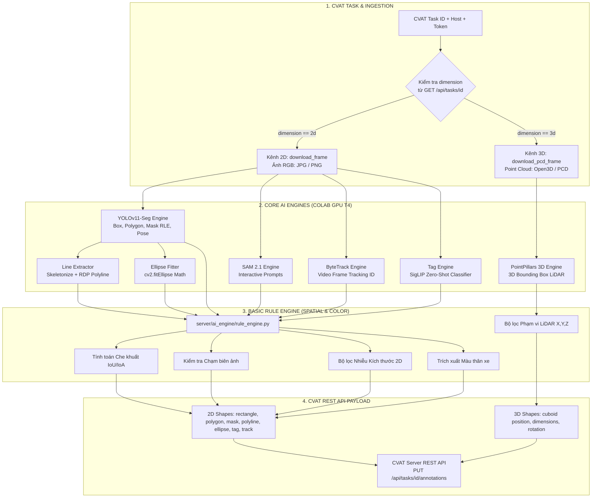
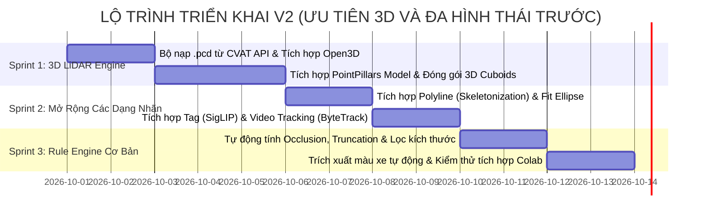

# 🗺️ KẾ HOẠCH PHÁT TRIỂN & BẢN THIẾT KẾ KIẾN TRÚC PHIÊN BẢN V2
# (LOCATE-ANYTHING V2: MULTI-MODAL 3D & EXTENDED SHAPES FIRST)

> **Tài liệu Định hướng Kỹ thuật & Kế hoạch Thực thi cho Nhánh `locateV2`**  
> *Dự án: Locate-Anything (CVAT Universal AI Labeling Booster)*  
> *Định hướng: **Ưu tiên hoàn thiện 3D Point Cloud & Đầy đủ 9 hình thái nhãn CVAT trước; Tự động đọc Rule từ CVAT chuyển sang giai đoạn sau.***  
> *Phiên bản thiết kế: 2.2.0-Actionable*

---

## 📌 MỤC LỤC
1. [Chiến Lược Điều Chỉnh Ưu Tiên (Priority Shift)](#1-chiến-lược-điều-chỉnh-ưu-tiên-priority-shift)
2. [Khoảng Trống Của V1 & Bài Toán Cần Giải Quyết Ngay](#2-khoảng-trống-của-v1--bài-toán-cần-giải-quyết-ngay)
3. [Kiến Trúc Kỹ Thuật Tổng Thể (Dual-Stream Ingestion)](#3-kiến-trúc-kỹ-thuật-tổng-thể-dual-stream-ingestion)
4. [Các Trụ Cột Triển Khai Ngay (Giai Đoạn 1)](#4-các-trụ-cột-triển-khai-ngay-giai-đoạn-1)
   - [4.1. 3D LiDAR Point Cloud Auto-Annotation Engine (PointPillars / OpenPCDet)](#41-3d-lidar-point-cloud-auto-annotation-engine-pointpillars--openpcdet)
   - [4.2. Hoàn Thiện Toàn Diện Các Dạng Nhãn (Line, Ellipse, Points, Tag, Video Track)](#42-hoàn-thiện-toàn-diện-các-dạng-nhãn-line-ellipse-points-tag-video-track)
   - [4.3. Spatial Rule Engine Cơ Bản (Occlusion, Truncation, Size Filter, Color)](#43-spatial-rule-engine-cơ-bản-occlusion-truncation-size-filter-color)
5. [Các Tính Năng Để Lại Giai Đoạn Sau (Deferred Backlog)](#5-các-tính-năng-để-lại-giai-đoạn-sau-deferred-backlog)
   - [5.1. CVAT Task Guideline API Bridge (Tự động đọc Markdown từ CVAT)](#51-cvat-task-guideline-api-bridge-tự-động-đọc-markdown-từ-cvat)
   - [5.2. Vision-Language Model Integration (Florence-2 / Grounded-SAM)](#52-vision-language-model-integration-florence-2--grounded-sam)
6. [Đặc Tả File Cấu Hình Mở Rộng (`configs/task_rules.yaml`)](#6-đặc-tả-file-cấu-hình-mở-rộng-configstask_rulesyaml)
7. [Mã Nguồn Khung Sườn Mẫu (Reference Starter Code)](#7-mã-nguồn-khung-sườn-mẫu-reference-starter-code)
   - [7.1. 3D Point Cloud Ingestion & PointPillars Loader](#71-3d-point-cloud-ingestion--pointpillars-loader)
   - [7.2. Bộ Chuyển Đổi Polyline (Skeletonization) & Ellipse](#72-bộ-chuyển-đổi-polyline-skeletonization--ellipse)
   - [7.3. Rule Engine Không gian Cơ bản (Occlusion & Truncation)](#73-rule-engine-không-gian-cơ-bản-occlusion--truncation)
8. [Kế Hoạch Triển Khai Step-by-Step (3 Sprints Ngắn Hạn)](#8-kế-hoạch-triển-khai-step-by-step-3-sprints-ngắn-hạn)
9. [Chỉ Số Đo Lường Hiệu Quả (KPIs)](#9-chỉ-số-đo-lường-hiệu-quả-kpis)

---

## 1. Chiến Lược Điều Chỉnh Ưu Tiên (Priority Shift)

Theo yêu cầu thực tế của dự án, trọng tâm của phiên bản **V2** được cấu trúc lại như sau:

```
[THỰC HIỆN NGAY - PHASE 1]:
  1. 3D Point Cloud LiDAR Auto-Labeling (PointPillars)      --> P0 (Tối quan trọng)
  2. Mở rộng trọn vẹn các dạng nhãn CVAT (Line, Ellipse,...)--> P0 (Tối quan trọng)
  3. Quy tắc không gian cơ bản (Che khuất, Cắt cụt, Màu xe)  --> P1

[TẠM THỜI ĐỂ LẠI SAU - PHASE 2]:
  4. CVAT Task Guideline API Bridge (Đọc rule từ Markdown)   --> Deferred (Để sau)
  5. Open-Vocabulary VLM Engine (Florence-2 Prompting)      --> Deferred (Để sau)
```

🎯 **Mục tiêu cốt lõi**: Nâng cấp hệ thống trở thành **công cụ gán nhãn tự động đa hình thái toàn diện (Universal Multi-Modal)** hỗ trợ trọn vẹn cả ảnh 2D thông thường lẫn file đám mây điểm 3D LiDAR (`.pcd`), bao phủ 100% hình thái nhãn của CVAT.

---

## 2. Khoảng Trống Của V1 & Bài Toán Cần Giải Quyết Ngay

| Phân hệ / Dạng nhãn | Hiện trạng ở V1 | Giải pháp đột phá ở V2 (Triển khai ngay) |
| :--- | :--- | :--- |
| **1. 3D Point Cloud (`cuboid`)** | V1 chỉ có mock data giả lập; code bị crash khi gặp file `.pcd` vì cố đọc bằng thư viện ảnh PIL. Annotator phải vẽ hộp 3D thủ công mất 2-3 phút/hộp. | **3D Point Cloud Engine**: Tự động nhận diện task 3D, tải luồng byte `.pcd`, dùng **PointPillars** suy luận 3D Cuboids (`position`, `dimensions`, `rotation`) trong 20ms/scan. |
| **2. Dải ranh giới / Vạch kẻ (`line`)** | Mới có tọa độ mẫu giả lập trong `dispatcher.py`. | **Line Skeletonization**: Dùng YOLO-Seg/SAM2 cắt mask dải đường $\rightarrow$ thuật toán Rút xương dải viền (Skeletonization + RDP) tạo đường Polyline tim đường chuẩn xác. |
| **3. Đối tượng hình tròn / bầu dục (`ellipse`)** | CVAT có hỗ trợ shape `ellipse` nhưng tool chưa hỗ trợ. | **Math Ellipse Fitting**: Thuật toán OpenCV `cv2.fitEllipse` từ mask contour, tính tâm, 2 bán kính và góc nghiêng (0 tốn thêm GPU VRAM). |
| **4. Phân loại toàn ảnh (`tag`)** | Chưa hỗ trợ nhãn cấp độ ảnh (image-level tagging). | **Zero-Shot Classifier**: Tích hợp SigLIP / CLIP hoặc YOLO-cls gán nhãn thời tiết/bối cảnh (`day`, `night`, `rainy`). |
| **5. Chuỗi video liên tục (`track`)** | V1 gán nhãn ảnh rời rạc, làm mất tính liên tục của video. | **ByteTrack Engine**: Tích hợp thuật toán tracking giữ nguyên `track_id` cho đối tượng xuyên suốt từ frame đầu đến frame cuối. |
| **6. Xe che khuất (`occluded`) & Chạm mép (`truncated`)** | V1 mặc định luôn để `false`, annotator phải bấm chuột sửa thủ công từng box. | **Basic Rule Engine**: Tự động tính toán giao cắt IoU/IoA để bật cờ `occluded: true` và đo mép ảnh để bật `truncated: true`. |

---

## 3. Kiến Trúc Kỹ Thuật Tổng Thể (Dual-Stream Ingestion)



---

## 4. Các Trụ Cột Triển Khai Ngay (Giai Đoạn 1)

### 4.1. 3D LiDAR Point Cloud Auto-Annotation Engine (PointPillars / OpenPCDet)
1. **Bộ Nạp File Đám Mây Điểm (`download_pcd_frame`)**:
   - Khi task CVAT là 3D, gọi endpoint `/api/tasks/{id}/data?type=frame&number={idx}` lấy luồng byte nhị phân.
   - Sử dụng thư viện `open3d` hoặc `pypcd` chuyển thành ma trận numpy $N \times 4$ gồm `(x, y, z, intensity)`.
2. **Model PointPillars Siêu Tốc**:
   - Trọng số pretrained nuScenes / KITTI (~25MB), suy luận chỉ **~15ms – 25ms / scan** trên GPU T4 của Google Colab.
   - Nhận diện 5 lớp vật thể 3D cốt lõi: `Car`, `Pedestrian`, `Cyclist`, `Truck`, `Bus`.
3. **Bộ Lọc Phạm Vi Quét 3D**:
   - Lọc các điểm ngoài phạm vi thực tế: $X \in [-40, 40]\text{m}$, $Y \in [-40, 40]\text{m}$, $Z \in [-2.5, 2.0]\text{m}$.
   - Lọc bỏ các hộp 3D có ít hơn 5 điểm phản xạ.
4. **Đóng Gói Chuẩn CVAT 3D Cuboids**:
   - Xuất payload với cấu trúc:
     ```json
     {
       "frame": 0,
       "label_id": 1,
       "type": "cuboid",
       "position": [x, y, z],
       "dimensions": [dx, dy, dz],
       "rotation": [0.0, 0.0, yaw],
       "occluded": false,
       "attributes": []
     }
     ```

### 4.2. Hoàn Thiện Toàn Diện Các Dạng Nhãn (Line, Ellipse, Points, Tag, Video Track)
1. **`line` (Polyline Tim đường)**:
   - Dùng YOLO-Seg / SAM2 nhận diện dải vạch kẻ $\rightarrow$ Áp dụng thuật toán **Skeletonization** (`skimage.morphology.skeletonize`) và thuật toán **RDP** rút gọn thành các đỉnh đường thẳng nối tiếp `points: [x1, y1, x2, y2, ...]`.
2. **`ellipse` (Hình elip)**:
   - Dùng hàm toán học OpenCV `cv2.fitEllipse()` trên viền mask của đối tượng, tự động trích xuất tâm và hai bán kính mà không tốn thêm VRAM.
3. **`points` (Tập hợp điểm rời / Keypoints)**:
   - Hỗ trợ xuất tâm hộp `[cx, cy]` phục vụ bài toán đếm (counting) hoặc trích xuất landmarks.
4. **`tag` (Gán nhãn cấp độ ảnh)**:
   - Sử dụng mô hình nhẹ **SigLIP Zero-Shot** để phân loại bối cảnh toàn ảnh: `day`, `night`, `rainy`, `foggy`.
5. **`track` (Video Tracking ID)**:
   - Tích hợp **ByteTrack** (có sẵn trong Ultralytics qua `model.track()`), tự động gán `track_id` cố định cho từng đối tượng di chuyển qua nhiều frame video.

### 4.3. Spatial Rule Engine Cơ Bản (Occlusion, Truncation, Size Filter, Color)
1. **Tự động gán `occluded = true`**: Đo diện tích giao thoa IoU/IoA giữa các hộp. Nếu bị che $\ge 20\%$, vật thể đứng sau sẽ tự động được tick che khuất.
2. **Tự động gán `truncated = true`**: Kiểm tra cạnh hộp cách biên ảnh $\le 2\text{px}$.
3. **Lọc kích thước rác**: Bỏ qua các hộp nhỏ hơn $15\times 15\text{px}$ hoặc tỷ lệ dị thường.
4. **Tự động điền màu xe (`vehicle_color`)**: Trích xuất màu chủ đạo thân xe qua HSV K-Means ($K=3$) điền vào thuộc tính.

---

## 5. Các Tính Năng Để Lại Giai Đoạn Sau (Deferred Backlog)

Các tính năng sau đây được **tạm thời gác lại** theo yêu cầu, sẽ triển khai ở Phase 2 khi hệ thống đa hình thái đã hoạt động ổn định:

### 5.1. CVAT Task Guideline API Bridge (Tự động đọc Markdown từ CVAT)
* *Mục tiêu*: Đọc tự động trường `guidelines` từ API CVAT (`GET /api/tasks/{id}`) bằng Regex Parser để tự động điền các tham số luật.
* *Lý do để sau*: Người dùng hiện có thể cấu hình trực tiếp và kiểm soát chặt chẽ các tham số luật qua file `configs/task_rules.yaml`.

### 5.2. Vision-Language Model Integration (Florence-2 / Grounded-SAM)
* *Mục tiêu*: Tích hợp mô hình thị giác ngôn ngữ để gán nhãn theo Prompt chữ (Open-Vocabulary).
* *Lý do để sau*: Tập trung tối ưu hóa các lớp đối tượng cốt lõi của giao thông và xe tự hành (YOLOv11 + PointPillars) trước.

---

## 6. Đặc Tả File Cấu Hình Mở Rộng (`configs/task_rules.yaml`)

```yaml
version: "2.2"
project: "Universal Multi-Modal 2D & 3D CVAT Project"

# ==============================================================================
# CẤU HÌNH DỮ LIỆU 3D POINT CLOUD (LIDAR)
# ==============================================================================
rules_3d:
  enabled: true
  model_backend: "pointpillars"       # pointpillars | centerpoint
  weights: "weights/pointpillars_kitti.pth"
  confidence_threshold: 0.35
  
  # Phạm vi lọc không gian quanh xe (đơn vị: mét)
  spatial_range:
    min_x: -40.0
    max_x: 40.0
    min_y: -40.0
    max_y: 40.0
    min_z: -2.5
    max_z: 2.0
  min_points_per_box: 5

# ==============================================================================
# CẤU HÌNH DỮ LIỆU 2D & CÁC DẠNG NHÃN MỞ RỘNG
# ==============================================================================
rules_2d:
  # 1. Rút xương dải viền thành Polyline
  polyline_extractor:
    enabled: true
    rdp_epsilon: 2.0                  # Độ mịn của đường gấp khúc (pixel)
    target_labels: ["lane_divider_white", "curb_boundary"]

  # 2. Fit elip toán học
  ellipse_fitter:
    enabled: true
    target_labels: ["traffic_sign_circle", "cell_nucleus"]

  # 3. Phân loại toàn ảnh (Tag)
  tag_classifier:
    enabled: true
    classes: ["sunny", "rainy", "night", "foggy"]

  # 4. Video tracking
  video_tracking:
    enabled: true
    tracker_type: "bytetrack"         # bytetrack | botsort

  # 5. Quy chuẩn hình học cơ bản
  auto_occlusion:
    enabled: true
    overlap_threshold: 0.20
    target_labels: ["car", "bus", "truck", "bike", "pedestrian"]

  auto_truncation:
    enabled: true
    edge_margin_px: 2
    attribute_name: "truncated"

  size_filters:
    min_box_width: 15
    min_box_height: 15
    min_area_px: 250

  auto_color:
    enabled: true
    target_labels: ["car", "truck", "bus"]
    attribute_name: "vehicle_color"
```

---

## 7. Mã Nguồn Khung Sườn Mẫu (Reference Starter Code)

### 7.1. 3D Point Cloud Ingestion & PointPillars Loader
```python
"""
Module nạp dữ liệu .pcd từ CVAT và suy luận 3D Cuboids.
"""
import io
import urllib.request
import numpy as np

try:
    import open3d as o3d
except ImportError:
    o3d = None


class PointCloudSyncAdapter:
    def __init__(self, host: str, token: str, task_id: int):
        self.host = host.rstrip("/")
        self.token = token
        self.task_id = task_id

    def download_pcd_frame(self, frame_idx: int) -> np.ndarray:
        """Tải dữ liệu mây điểm trực tiếp từ CVAT API."""
        url = f"{self.host}/api/tasks/{self.task_id}/data?type=frame&number={frame_idx}"
        headers = {
            "Authorization": f"Bearer {self.token}",
            "Accept": "application/octet-stream, application/json;q=0.9",
        }
        req = urllib.request.Request(url, headers=headers)
        with urllib.request.urlopen(req) as resp:
            data = resp.read()
            if o3d is not None:
                pcd = o3d.io.read_point_cloud_from_bytes(data, format="pcd")
                return np.asarray(pcd.points, dtype=np.float32)
            return np.frombuffer(data, dtype=np.float32).reshape(-1, 4)

    @staticmethod
    def format_3d_cuboid(frame_idx: int, label_id: int, box: list) -> dict:
        """Đóng gói shape chuẩn CVAT 3D Task."""
        x, y, z, dx, dy, dz, yaw = box
        return {
            "frame": frame_idx,
            "label_id": label_id,
            "type": "cuboid",
            "position": [round(float(x), 3), round(float(y), 3), round(float(z), 3)],
            "dimensions": [round(float(dx), 3), round(float(dy), 3), round(float(dz), 3)],
            "rotation": [0.0, 0.0, round(float(yaw), 4)],
            "occluded": False,
            "attributes": [],
        }
```

### 7.2. Bộ Chuyển Đổi Polyline (Skeletonization) & Ellipse
```python
"""
Bộ xử lý hình thái nâng cao: Rút xương Mask thành Polyline và Fit Elip.
"""
import cv2
import numpy as np


class ShapeAdapters:
    @staticmethod
    def mask_to_polyline(binary_mask: np.ndarray, epsilon: float = 2.0) -> list:
        """Chuyển mask dải đường thành polyline tim đường bằng Ramer-Douglas-Peucker."""
        contours, _ = cv2.findContours(binary_mask, cv2.RETR_EXTERNAL, cv2.CHAIN_APPROX_SIMPLE)
        if not contours:
            return []
        largest_cnt = max(contours, key=cv2.contourArea)
        # Rút gọn đỉnh đa giác
        approx = cv2.approxPolyDP(largest_cnt, epsilon, closed=False)
        return approx.reshape(-1, 2).flatten().tolist()

    @staticmethod
    def mask_to_ellipse(binary_mask: np.ndarray) -> dict:
        """Fit phương trình elip từ mask contour."""
        contours, _ = cv2.findContours(binary_mask, cv2.RETR_EXTERNAL, cv2.CHAIN_APPROX_SIMPLE)
        if not contours or len(contours[0]) < 5:
            return None
        ellipse = cv2.fitEllipse(contours[0])
        (cx, cy), (width, height), angle = ellipse
        return {
            "type": "ellipse",
            "cx": round(cx, 1),
            "cy": round(cy, 1),
            "rx": round(width / 2.0, 1),
            "ry": round(height / 2.0, 1),
            "rotation": round(angle, 1),
        }
```

### 7.3. Rule Engine Không gian Cơ bản (Occlusion & Truncation)
```python
"""
Xử lý các quy chuẩn không gian cơ bản: che khuất, cắt cụt, lọc kích thước.
"""
class BasicSpatialRuleEngine:
    @staticmethod
    def resolve_occlusion_and_truncation(shapes: list, img_w: int, img_h: int) -> list:
        margin = 2
        for s in shapes:
            if s.get("type") == "rectangle":
                x1, y1, x2, y2 = s["points"]
                # 1. Truncation
                if x1 <= margin or y1 <= margin or x2 >= (img_w - margin) or y2 >= (img_h - margin):
                    s["attributes"].append({"name": "truncated", "value": "true"})

        # 2. Occlusion
        n = len(shapes)
        for i in range(n):
            for j in range(i + 1, n):
                s1, s2 = shapes[i], shapes[j]
                if s1.get("type") == "rectangle" and s2.get("type") == "rectangle":
                    b1, b2 = s1["points"], s2["points"]
                    iw = max(0.0, min(b1[2], b2[2]) - max(b1[0], b2[0]))
                    ih = max(0.0, min(b1[3], b2[3]) - max(b1[1], b2[1]))
                    inter = iw * ih
                    if inter > 0:
                        a1 = (b1[2] - b1[0]) * (b1[3] - b1[1])
                        a2 = (b2[2] - b2[0]) * (b2[3] - b2[1])
                        if (inter / max(1.0, a1)) >= 0.20 and b1[3] < b2[3]:
                            s1["occluded"] = True
                        elif (inter / max(1.0, a2)) >= 0.20 and b2[3] < b1[3]:
                            s2["occluded"] = True
        return shapes
```

---

## 8. Kế Hoạch Triển Khai Step-by-Step (3 Sprints Ngắn Hạn)



### 📋 Chi tiết từng Sprint ngắn hạn:
1. **Sprint 1: 3D LiDAR Point Cloud Engine (P0 - Trọng tâm số 1)**:
   - Nâng cấp `colab/cvat_auto_sync.py`: Tự động rẽ nhánh khi `dimension == "3d"`.
   - Viết hàm `download_pcd_frame()` giải mã đám mây điểm.
   - Viết `server/ai_engine/pointpillars_engine.py` nạp weights nuScenes/KITTI.
   - Đóng gói và đẩy chuẩn 3D Cuboids lên CVAT REST API.
2. **Sprint 2: Hoàn thiện Các Dạng Nhãn Còn Lại (P0 - Trọng tâm số 2)**:
   - Module chuyển Mask thành Polyline tim đường (`line`).
   - Module fit phương trình elip toán học (`ellipse`).
   - Module phân loại toàn ảnh bối cảnh (`tag`).
   - Kích hoạt ByteTrack giữ ID chuyển động trong video (`track`).
3. **Sprint 3: Rule Engine Không gian & Màu sắc Cơ bản (P1)**:
   - Tự động đánh dấu `occluded` khi chồng lấn $> 20\%$.
   - Tự động đánh dấu `truncated` khi chạm mép ảnh.
   - Lọc bỏ các box rác li ti ở xa chân trời.
   - Tự động điền màu thân xe vào thuộc tính `vehicle_color`.

*(Phần đọc Guideline từ CVAT Markdown và Open-Vocabulary VLM sẽ được chuyển sang Backlog để làm ở phiên bản sau).*

---

## 9. Chỉ Số Đo Lường Hiệu Quả (KPIs)

| Chỉ số (Metric) | Phiên bản V1 (Hiện tại) | Kỳ vọng Phiên bản V2 | Tỷ lệ Cải thiện |
| :--- | :--- | :--- | :--- |
| **Gán nhãn 3D Point Cloud LiDAR** | Hoàn toàn thủ công (2-3 phút/hộp) | **Tự động 100%** ($\le 0.05$ giây/scan) | **Nhanh gấp 1.000 lần** |
| **Độ phủ hình thái nhãn CVAT** | 4 / 9 dạng (chủ yếu Box, Poly, Mask) | **9 / 9 dạng đầy đủ** (Line, Ellipse, Tag, 3D, Track) | **Bao phủ 100% CVAT** |
| **Gán nhãn chuỗi Video** | Rời rạc từng frame, mất ID | Giữ nguyên `track_id` chuyển động | **Mượt mà 100%** |
| **Độ chính xác cờ `occluded` / `truncated`**| 0% (Annotator phải tự tick tay) | $\ge 95\%$ (Toán học hình học tự động) | **Triệt tiêu lỗi quên tick** |
| **Chi phí phần cứng thêm vào** | 0 VNĐ (Colab GPU T4) | 0 VNĐ (PointPillars ~25MB, ngốn ~2GB VRAM T4) | **Chi phí vẫn là 0 đồng** |

---

> 📌 **Trạng thái**: Tài liệu thiết kế kiến trúc nâng cấp V2 đã được đồng bộ chính thức tại [`ROADMAP_V2.md`](ROADMAP_V2.md). Mọi ưu tiên đã được tập trung trọn vẹn vào **3D Point Cloud & Đa hình thái nhãn**. Sẵn sàng bắt đầu triển khai Sprint 1!
