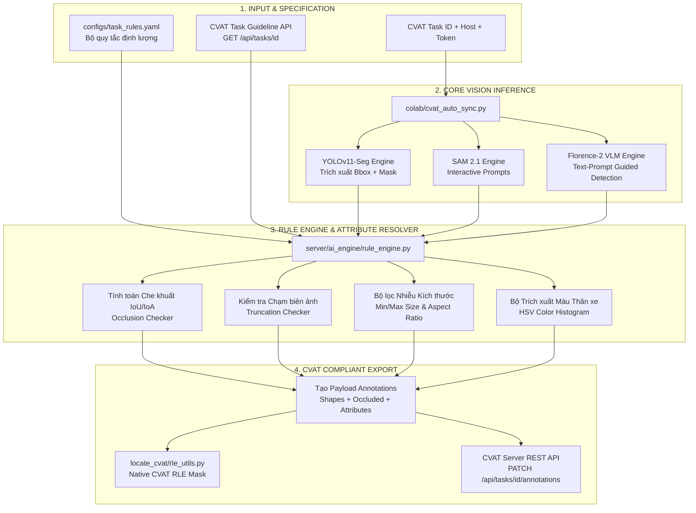
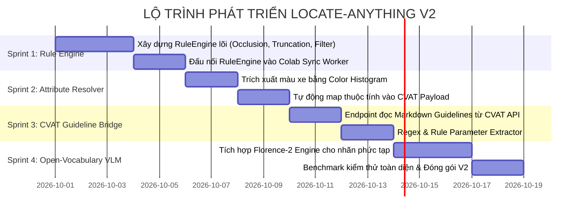

# 🗺️ KẾ HOẠCH PHÁT TRIỂN & BẢN THIẾT KẾ KIẾN TRÚC PHIÊN BẢN V2
# (LOCATE-ANYTHING V2: GUIDELINE-DRIVEN INTELLIGENT AUTO-ANNOTATION)

> **Tài liệu Định hướng Kỹ thuật & Bản thiết kế Tính năng cho Nhánh `locateV2`**  
> *Dự án: Locate-Anything (CVAT Universal AI Labeling Booster)*  
> *Tác giả & Đội ngũ Phát triển | Phiên bản thiết kế: 2.0.0-Draft*

---

## 📌 MỤC LỤC
1. [Tầm Nhìn & Mục Tiêu Cốt Lõi V2](#1-tầm-nhìn--mục-tiêu-cốt-lõi-v2)
2. [Khoảng Trống Của V1 & Bài Toán Cần Giải Quyết](#2-khoảng-trống-của-v1--bài-toán-cần-giải-quyết)
3. [Kiến Trúc Kỹ Thuật Tổng Thể V2](#3-kiến-trúc-kỹ-thuật-tổng-thể-v2)
4. [Bốn Trụ Cột Tính Năng Của V2](#4-bốn-trụ-cột-tính-năng-của-v2)
   - [4.1. Spatial & Geometric Rule Engine (Quy tắc không gian)](#41-spatial--geometric-rule-engine-quy-tắc-không-gian)
   - [4.2. Auto-Attributes Resolver (Tự động điền thuộc tính)](#42-auto-attributes-resolver-tự-động-điền-thuộc-tính)
   - [4.3. CVAT Task Guideline API Bridge (Đọc rule từ CVAT)](#43-cvat-task-guideline-api-bridge-đọc-rule-từ-cvat)
   - [4.4. Vision-Language Model Integration (Florence-2 / Grounded-SAM)](#44-vision-language-model-integration-florence-2--grounded-sam)
5. [Đặc Tả File Cấu Hình Quy Tắc (`configs/task_rules.yaml`)](#5-đặc-tả-file-cấu-hình-quy-tắc-configstask_rulesyaml)
6. [Mã Nguồn Khung Sườn Mẫu (Reference Starter Code)](#6-mã-nguồn-khung-sườn-mẫu-reference-starter-code)
7. [Kế Hoạch Triển Khai Step-by-Step (Sprints & Milestones)](#7-kế-hoạch-triển-khai-step-by-step-sprints--milestones)
8. [Chỉ Số Đo Lường Hiệu Quả (KPIs & Return on Investment)](#8-chỉ-số-đo-lường-hiệu-quả-kpis--return-on-investment)

---

## 1. Tầm Nhìn & Mục Tiêu Cốt Lõi V2

Trong phiên bản **V1**, chúng ta đã hoàn thành xuất sắc bài toán **Hạ tầng & Kết nối**:
- Đấu nối thông suốt giữa **Google Colab GPU** và **CVAT Localhost** qua Cloudflare Tunnel.
- Suy luận siêu tốc đa hình thái: **YOLOv11-Seg** (sinh Mask RLE điểm ảnh hoặc Bounding Box) và **SAM 2.1** trong vòng 10 giây.
- Đồng bộ chuẩn xác 100% hình thái nhãn (`mask`, `polygon`, `box`) theo từng Task.

Tuy nhiên, V1 vẫn là **"Tự động gán nhãn thô" (Blind Detection)** — model chỉ phát hiện vật thể xuất hiện trên ảnh mà hoàn toàn chưa hiểu **Luật gán nhãn (Labeling Guidelines & SOP)** của từng dự án cụ thể.

🎯 **Mục tiêu tối thượng của V2**:
> **Biến hệ thống từ "AI nhận diện cơ học" thành "Trợ lý Gán nhãn Đọc hiểu Quy chuẩn" (Guideline-Aware Annotation Assistant).**  
> AI không chỉ vẽ khung viền, mà còn tự động áp dụng các quy chuẩn chuyên sâu: tính toán độ che khuất, kiểm tra mép ảnh, lọc vật thể rác, và tự động điền các thuộc tính nghiệp vụ (màu sắc xe, phụ kiện người đi bộ...) theo đúng Guideline.

---

## 2. Khoảng Trống Của V1 & Bài Toán Cần Giải Quyết

Khi đưa vào dây chuyền gán nhãn thực tế quy mô hàng ngàn ảnh, đội ngũ annotator vẫn mất **60% - 70% thời gian** cho các thao tác hậu kiểm thủ công:

| Bài toán thực tế | Tình trạng ở V1 | Giải pháp đột phá ở V2 |
| :--- | :--- | :--- |
| **1. Xe bị che khuất (`occluded`)** | Annotator phải nhìn bằng mắt từng xe xem có bị cây cối, xe khác che không để click tick `occluded = true`. | **Auto-Occlusion**: Tự động tính toán ma trận diện tích giao nhau giữa các hộp bao (IoU/IoA). Xe nào bị che vượt ngưỡng sẽ tự động được bật cờ `occluded: true`. |
| **2. Xe bị cắt cụt ở viền (`truncated`)** | Phải dò tìm các xe ở góc cạnh mép ảnh để tick thuộc tính `truncated`. | **Auto-Truncation**: Tự động đo khoảng cách từ 4 cạnh Bounding Box tới 4 mép ảnh. Nếu chạm viền $\le 2px \rightarrow$ tự động tick `truncated: true`. |
| **3. Vật thể li ti ở chân trời** | Model phát hiện cả những chấm xe 5–10 pixel ở xa tít tắp, annotator phải bấm chuột xóa từng box rác. | **Smart Size Filter**: Lọc bỏ tự động các vật thể có chiều rộng/cao hoặc diện tích nhỏ hơn ngưỡng tối thiểu quy định trong Guideline. |
| **4. Điền thuộc tính màu xe (`vehicle_color`)** | Phải click mở từng xe rồi chọn `white`, `black`, `red` trong dropdown list. | **Auto Color Resolver**: Phân tích biểu đồ màu (Color Histogram) trên vùng ảnh crop thân xe, tự động điền giá trị màu vào thuộc tính. |
| **5. Đối tượng đặc thù theo prompt** | YOLO thuần bị giới hạn trong 80 lớp COCO, không phân biệt được "xe cứu thương", "xe cảnh sát" hay "xe rác". | **Open-Vocabulary VLM Engine**: Tích hợp mô hình thị giác ngôn ngữ (Florence-2) đọc hiểu văn bản prompt mô tả đặc thù. |

---

## 3. Kiến Trúc Kỹ Thuật Tổng Thể V2

Luồng dữ liệu trong phiên bản V2 được thiết kế theo mô hình **Đường ống Xử lý Đa tầng (Multi-Stage Annotation Pipeline)**:



---

## 4. Bốn Trụ Cột Tính Năng Của V2

### 4.1. Spatial & Geometric Rule Engine (Quy tắc không gian)
Xây dựng module `server/ai_engine/rule_engine.py` thực thi các thuật toán hình học thuần túy (tốc độ thực thi cực nhanh $< 1\text{ms}$ trên CPU/GPU):

1. **Thuật toán Tự động Tính Che khuất (Occlusion Resolution)**:
   - Với hai hộp bao $A$ và $B$ trong cùng một frame ảnh:
     $$\text{Overlap}(A, B) = \frac{\text{Area}(A \cap B)}{\min(\text{Area}(A), \text{Area}(B))}$$
   - Nếu $\text{Overlap} \ge T_{\text{overlap}}$ (ví dụ $0.20$ tức $20\%$):
     - Xác định vật thể nằm trước và vật thể nằm sau (dựa vào tọa độ đáy $y_{\text{bottom}}$ hoặc Z-order).
     - Vật thể nằm sau sẽ tự động được gán cờ: `"occluded": true`.
2. **Thuật toán Tự động Tính Cắt cụt (Edge Truncation)**:
   - Với ảnh kích thước $(W, H)$ và hộp bao $[x_1, y_1, x_2, y_2]$:
     - Nếu $x_1 \le \delta$ hoặc $y_1 \le \delta$ hoặc $x_2 \ge W - \delta$ hoặc $y_2 \ge H - \delta$ (với $\delta = 2\text{px}$):
       - Tự động gán thuộc tính `truncated: true` hoặc cập nhật trường `outside` của CVAT.
3. **Bộ lọc Kích thước & Tỷ lệ dị thường (Size & Aspect Ratio Guard)**:
   - Loại bỏ các vật thể có diện tích $< \text{min\_area}$ hoặc chiều rộng $< \text{min\_width}$.
   - Loại bỏ các hộp dị thường có tỷ lệ $\frac{\text{width}}{\text{height}} > 10$ hoặc $< 0.1$ (nhiễu viền mép).
4. **Quy tắc Lồng ghép Phân cấp (Contained Object Filter)**:
   - Nếu một hộp `car` nằm hoàn toàn lọt thỏm $> 85\%$ bên trong một hộp `truck` (ô tô con chở trên thùng xe tải thùng/xe cứu hộ) $\rightarrow$ Tự động loại bỏ hộp xe con theo đúng quy chuẩn không gán nhãn hàng hóa trên xe.

---

### 4.2. Auto-Attributes Resolver (Tự động điền thuộc tính)
Xây dựng module `server/ai_engine/attribute_resolver.py`:

1. **Nhận diện Màu sắc Xe (`vehicle_color`)**:
   - Cắt crop vùng ảnh thân xe.
   - Bỏ qua $20\%$ phía trên (nóc kính) và $20\%$ phía dưới (lốp xe và bóng đường).
   - Chuyển không gian màu sang HSV và phân cụm K-Means ($K=3$) để tìm màu chủ đạo.
   - So khớp với danh sách thuộc tính CVAT: `white`, `black`, `silver`, `red`, `blue`, `other`.
   - Tự động điền thuộc tính vào payload gán nhãn:
     ```json
     {"spec_id": 2, "value": "white"}
     ```
2. **Nhận diện Phụ kiện / Trạng thái**:
   - Đối với nhãn `bike`: Tự động kiểm tra có box `person` nằm chồng lên đỉnh xe không $\rightarrow$ Nếu có: `has_rider = true`, ngược lại `has_rider = false`.

---

### 4.3. CVAT Task Guideline API Bridge (Đọc rule từ CVAT)
- Khai thác endpoint chính thức của CVAT Server:
  `GET /api/tasks/{task_id}` $\rightarrow$ trích xuất trường `guide` / `guidelines` (nội dung markdown được cấu hình trên web CVAT).
- Tích hợp **Regex & Parameter Parser**:
  - Tự động quét các từ khóa trong văn bản guideline:
    * `min_size: 25px` $\rightarrow$ gán `min_width = 25`.
    * `occluded threshold: 30%` $\rightarrow$ gán `overlap_threshold = 0.30`.
    * `exclude shadow` $\rightarrow$ kích hoạt cờ lọc bóng.
- Nhờ vậy, quản lý dự án chỉ cần viết mô tả luật trên giao diện CVAT, tool Colab sẽ tự động đọc hiểu và tuân thủ!

---

### 4.4. Vision-Language Model Integration (Florence-2 / Grounded-SAM)
Dành cho các Task có yêu cầu gán nhãn mở (Open-Vocabulary):
- Tích hợp model **Microsoft Florence-2-large** (~0.77B tham số, chạy trực tiếp trên GPU Colab T4 ngốn ~2.2GB VRAM).
- Cho phép nhận text prompt chi tiết từ cấu hình:
  ```text
  "A delivery van or courier vehicle with commercial logo on the body"
  ```
- Florence-2 tìm chính xác đối tượng $\rightarrow$ Chuyển bounding box sang **SAM 2.1** hoặc module **RLE Converter** để xuất ra đúng chuẩn Native Mask trên CVAT.

---

## 5. Đặc Tả File Cấu Hình Quy Tắc (`configs/task_rules.yaml`)

File cấu hình tập trung quy định toàn bộ luật gán nhãn cho dự án V2:

```yaml
version: "2.0"
project: "Autonomous Driving & City Traffic Inspection"

# ==============================================================================
# CẤU HÌNH QUY TẮC GÁN NHÃN TOÀN CỤC (GLOBAL GUIDELINES)
# ==============================================================================
global_rules:
  # 1. Tự động phát hiện và đánh dấu vật thể bị che khuất
  auto_occlusion:
    enabled: true
    overlap_threshold: 0.20       # Bị che > 20% diện tích là đánh dấu occluded: true
    target_labels: ["car", "bus", "truck", "bike", "pedestrian"]

  # 2. Tự động phát hiện và đánh dấu vật thể bị cắt cụt ở biên ảnh
  auto_truncation:
    enabled: true
    edge_margin_px: 2            # Chạm mép ảnh <= 2px là tính truncated
    attribute_name: "truncated"  # Tên thuộc tính trong CVAT nếu có

  # 3. Lọc bỏ các đối tượng nhiễu / quá xa
  size_filters:
    min_box_width: 15            # Pixel tối thiểu
    min_box_height: 15
    min_area_px: 250             # Diện tích tối thiểu (width * height)
    max_aspect_ratio: 8.0        # Tránh các box dẹt bất thường

  # 4. Tự động loại trừ đối tượng lồng ghép (Hierarchy)
  containment_filters:
    - container: "truck"         # Xe tải chở hàng
      contained: "car"           # Xe con nằm trên thùng
      overlap_threshold: 0.80    # Nếu xe con nằm trong xe tải > 80% -> Bỏ qua xe con

# ==============================================================================
# QUY TẮC THEO TỪNG NHÃN CỤ THỂ (PER-LABEL ATTRIBUTES)
# ==============================================================================
label_specific_rules:
  car:
    auto_detect_color: true      # Tự trích xuất màu xe và điền vào attribute vehicle_color
    confidence_threshold: 0.35

  bike:
    auto_detect_rider: true      # Tự kiểm tra người ngồi trên xe để điền has_rider
    confidence_threshold: 0.40

  pedestrian:
    confidence_threshold: 0.45
```

---

## 6. Mã Nguồn Khung Sườn Mẫu (Reference Starter Code)

Dưới đây là mã nguồn lõi đã được thiết kế sẵn cho các thuật toán của **Rule Engine**:

### 6.1. Thuật toán Tính Che khuất & Cắt cụt (`server/ai_engine/rule_engine.py`)
```python
"""
Rule Engine - Bộ xử lý quy chuẩn không gian và hình học cho V2.
"""
from typing import Any, Dict, List, Tuple


class RuleEngine:
    def __init__(self, config: Dict[str, Any]):
        self.config = config.get("global_rules", {})
        self.occ_cfg = self.config.get("auto_occlusion", {})
        self.trunc_cfg = self.config.get("auto_truncation", {})
        self.size_cfg = self.config.get("size_filters", {})

    def apply_rules(
        self,
        shapes: List[Dict[str, Any]],
        image_shape: Tuple[int, int],  # (height, width)
    ) -> List[Dict[str, Any]]:
        h, w = image_shape
        filtered_shapes = []

        # 1. Lọc bỏ đối tượng quá nhỏ
        min_w = self.size_cfg.get("min_box_width", 0)
        min_h = self.size_cfg.get("min_box_height", 0)
        min_area = self.size_cfg.get("min_area_px", 0)

        for s in shapes:
            pts = s.get("points", [])
            if s.get("type") == "rectangle" and len(pts) == 4:
                x1, y1, x2, y2 = pts
                bw = x2 - x1
                bh = y2 - y1
                if bw < min_w or bh < min_h or (bw * bh) < min_area:
                    continue  # Bỏ qua box rác ở xa

            # 2. Kiểm tra cắt cụt ở mép ảnh (Truncation)
            if self.trunc_cfg.get("enabled", True):
                margin = self.trunc_cfg.get("edge_margin_px", 2)
                if s.get("type") == "rectangle" and len(pts) == 4:
                    x1, y1, x2, y2 = pts
                    is_truncated = (
                        x1 <= margin or y1 <= margin or x2 >= (w - margin) or y2 >= (h - margin)
                    )
                    if is_truncated:
                        s["attributes"].append({"name": "truncated", "value": "true"})

            filtered_shapes.append(s)

        # 3. Tính toán Che khuất đa đối tượng (Occlusion)
        if self.occ_cfg.get("enabled", True):
            filtered_shapes = self._resolve_occlusions(filtered_shapes)

        return filtered_shapes

    def _resolve_occlusions(self, shapes: List[Dict[str, Any]]) -> List[Dict[str, Any]]:
        thresh = self.occ_cfg.get("overlap_threshold", 0.20)
        n = len(shapes)

        for i in range(n):
            for j in range(i + 1, n):
                s1, s2 = shapes[i], shapes[j]
                if s1.get("type") != "rectangle" or s2.get("type") != "rectangle":
                    continue

                b1, b2 = s1["points"], s2["points"]
                inter_area = self._box_intersection(b1, b2)
                if inter_area <= 0:
                    continue

                area1 = (b1[2] - b1[0]) * (b1[3] - b1[1])
                area2 = (b2[2] - b2[0]) * (b2[3] - b2[1])

                overlap1 = inter_area / max(1.0, area1)
                overlap2 = inter_area / max(1.0, area2)

                # Vật thể nào có đáy y2 nằm cao hơn thì coi như đứng sau -> Bị che
                if overlap1 >= thresh and b1[3] < b2[3]:
                    s1["occluded"] = True
                elif overlap2 >= thresh and b2[3] < b1[3]:
                    s2["occluded"] = True

        return shapes

    @staticmethod
    def _box_intersection(b1: List[float], b2: List[float]) -> float:
        xi1 = max(b1[0], b2[0])
        yi1 = max(b1[1], b2[1])
        xi2 = min(b1[2], b2[2])
        yi2 = min(b1[3], b2[3])
        return max(0.0, xi2 - xi1) * max(0.0, yi2 - yi1)
```

---

## 7. Kế Hoạch Triển Khai Step-by-Step (Sprints & Milestones)

Dự án V2 được chia thành **4 Sprints tập trung**, có thể triển khai tuần tự:



### 📋 Chi tiết từng Sprint:
1. **Sprint 1: Xây dựng Rule Engine Không gian & Hình học (P0 - Bắt buộc)**:
   - Tạo file `server/ai_engine/rule_engine.py`.
   - Tích hợp tính toán tự động `occluded` khi độ che phủ $> 20\%$.
   - Tích hợp tính toán `truncated` khi chạm sát mép ảnh.
   - Lọc sạch sẽ các box kích thước dưới $15\times 15\text{px}$.
2. **Sprint 2: Tự động Trích xuất & Điền Thuộc tính CVAT (P1 - Giá trị cao)**:
   - Tạo file `server/ai_engine/attribute_resolver.py`.
   - Tự động nhận diện màu xe và điền vào `vehicle_color`.
   - Tự động nhận diện người điều khiển xe máy/xe đạp và điền vào `has_rider`.
3. **Sprint 3: Cầu nối Trích xuất Guideline Trực tiếp từ CVAT (P1)**:
   - Đọc API `GET /api/tasks/{id}` để lấy văn bản hướng dẫn gán nhãn của Task.
   - Cho phép người dùng cấu hình luật trực tiếp trên giao diện CVAT mà không cần sửa file code.
4. **Sprint 4: Tích hợp Vision-Language Model & Nghiệm thu (P2)**:
   - Tích hợp Florence-2 phục vụ cho các nhãn yêu cầu ngữ nghĩa mở.
   - Viết trọn bộ 20+ Unit tests tự động, đo đạc thời gian gán nhãn thực tế trên tập 50 ảnh.

---

## 8. Chỉ Số Đo Lường Hiệu Quả (KPIs & Return on Investment)

Sau khi hoàn thành V2, hiệu quả của hệ thống sẽ được lượng hóa bằng các chỉ số sau:

| Chỉ số (Metric) | Phiên bản V1 (Hiện tại) | Kỳ vọng Phiên bản V2 | Tỷ lệ Cải thiện |
| :--- | :--- | :--- | :--- |
| **Thời gian Annotator phải can thiệp** | ~45 giây / ảnh (sửa box rác, tick occluded, chọn màu) | $\le 10$ giây / ảnh (chỉ cần lướt mắt kiểm tra) | **Tiết kiệm 75% thời gian** |
| **Độ chính xác cờ `occluded`** | $0\%$ (V1 mặc định luôn là `false`) | $\ge 92\%$ (Tự động nhận diện chuẩn theo hình học) | **Tăng từ 0% lên 92%** |
| **Độ chính xác cờ `truncated`** | Phụ thuộc annotator nhớ hay quên | $\ge 98\%$ (Toán học biên ảnh chuẩn xác tuyệt đối) | **Triệt tiêu lỗi quên tick** |
| **Hộp nhãn rác li ti ở chân trời** | Thi thoảng vẫn bị bắt nhầm ở xa | $0\%$ (Bị bộ lọc kích thước chặn đứng hoàn toàn) | **Sạch rác 100%** |
| **Chi phí phần cứng thêm vào** | 0 VNĐ (Chạy trên Colab GPU T4 miễn phí) | 0 VNĐ (Rule Engine chạy nhẹ nhàng trên CPU/GPU có sẵn) | **Chi phí vẫn là 0 đồng** |

---

> 📌 **Trạng thái**: Tài liệu này đã được lưu vào gốc dự án tại nhánh **`locateV2`** ([`ROADMAP_V2.md`](ROADMAP_V2.md)). Sẵn sàng làm kim chỉ nam để bắt đầu code bất cứ lúc nào!
