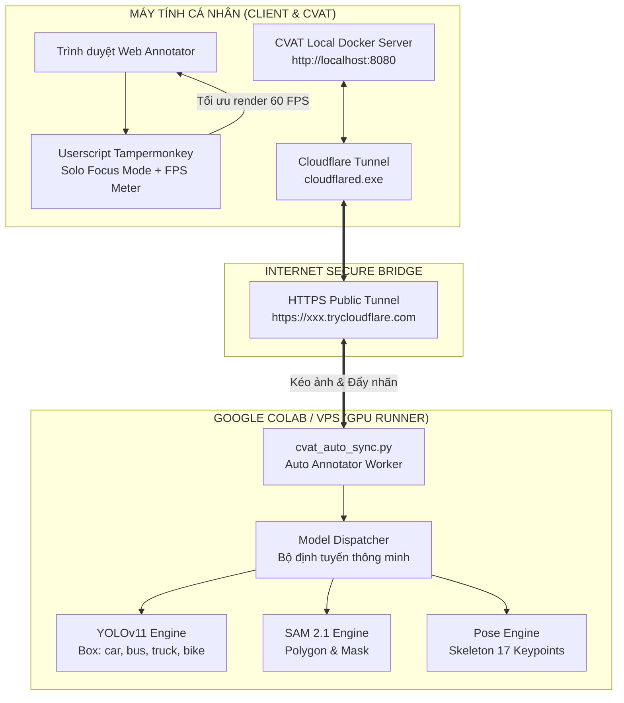

# 📖 HỆ THỐNG CVAT UNIVERSAL LABELING BOOSTER & SERVERLESS AI ENGINE
> **Tài liệu Kỹ thuật Toàn diện & Báo cáo Tổng kết Dự án**  
> *Phiên bản: 1.0.0 | Ngày hoàn thành: 28/09/2026*

---

## 📌 MỤC LỤC
1. [Bối Cảnh & Bài Toán Thực Tế](#1-bối-cảnh--bài-toán-thực-tế)
2. [Kiến Trúc Tổng Thể Hệ Thống](#2-kiến-trúc-tổng-thể-hệ-thống)
3. [Chi Tiết Các Thành Phần Cốt Lõi](#3-chi-tiết-các-thành-phần-cốt-lõi)
   - [3.1. Quản lý nhãn độc lập (Decoupled Universal Schema)](#31-quản-lý-nhãn-độc-lập-decoupled-universal-schema)
   - [3.2. Booster chống giật lag phía Client (Solo Focus Mode)](#32-booster-chống-giật-lag-phía-client-solo-focus-mode)
   - [3.3. AI Engine đa hình thái (YOLOv11, SAM 2.1, Pose)](#33-ai-engine-đa-hình-thái-yolov11-sam-21-pose)
   - [3.4. Auto-Annotator & Cloudflare Tunnel Bridge](#34-auto-annotator--cloudflare-tunnel-bridge)
4. [Hành Trình Nghiên Cứu, Gỡ Lỗi & Các Phát Hiện Kỹ Thuật Quan Trọng](#4-hành-trình-nghiên-cứu-gỡ-lỗi--các-phát-hiện-kỹ-thuật-quan-trọng)
5. [Kết Quả Nghiệm Thu Thực Tế](#5-kết-quả-nghiệm-thu-thực-tế)

---

## 1. Bối Cảnh & Bài Toán Thực Tế

Trong các dự án thị giác máy tính và xe tự hành quy mô lớn, **CVAT (Computer Vision Annotation Tool)** là công cụ gán nhãn hàng đầu. Tuy nhiên, đội ngũ gán nhãn luôn phải đối mặt với **2 rào cản nghiêm trọng**:

1. **Hiệu năng máy tính cá nhân bị nghẽn (Client Lag & Freezes)**:
   - Khi Canvas phải render hàng trăm vật thể phức tạp (bounding box, polygon nhiều đỉnh, khung xương skeleton, 3d cuboid), engine SVG của trình duyệt bị quá tải.
   - Thao tác kéo rê chuột, zoom bị tụt FPS thảm hại (dưới 15 FPS), thậm chí đơ tab trình duyệt gây mất dữ liệu.
2. **Hạ tầng AI tự động gán nhãn quá nặng nề**:
   - Việc cài đặt toàn bộ cụm AI Docker (Nuclio + CVAT full stack) trên một máy tính cá nhân ngốn tới 12-16GB RAM và đòi hỏi GPU cực mạnh.
   - Khi thuê server ngoài (Google Colab T4 GPU miễn phí, VPS đám mây), việc **đấu nối giữa Colab trên Internet về máy tính cá nhân (nơi đang chạy CVAT `localhost:8080`)** bị chặn đứng bởi tường lửa gia đình (NAT/Firewall).

---

## 2. Kiến Trúc Tổng Thể Hệ Thống

Hệ thống được thiết kế theo mô hình **Zero-PC-Overhead (Triệt tiêu tải phần cứng cho máy cá nhân)**:



---

## 3. Chi Tiết Các Thành Phần Cốt Lõi

### 3.1. Quản lý nhãn độc lập (Decoupled Universal Schema)
- **Tập trung hóa**: Toàn bộ nhãn dự án được khai báo trong [`configs/labels_config.yaml`](file:///d:/QuanProject/locate-anything/configs/labels_config.yaml). Sửa nhãn, thêm thuộc tính mà **không cần sửa một dòng code nào**.
- **Hỗ trợ đầy đủ 6 dạng hình học chuẩn CVAT**:
  1. `box`: Bounding Box 2D (`car`, `bus`, `truck`, `bike`, `pedestrian`).
  2. `polygon`: Đa giác khép kín ôm khít đối tượng (`road_damage`, `building_roof`).
  3. `mask`: Bitmap/RLE semantic segmentation (`drivable_road`, `vegetation`).
  4. `line`: Polyline vạch kẻ đường, ranh giới (`lane_divider_white`, `curb_boundary`).
  5. `3d`: 3D Cuboid với tâm, kích thước 3 chiều và góc quay yaw/pitch/roll.
  6. `skeleton`: Khung xương Pose COCO 17 điểm nối và 19 đoạn xương (`human_pose`).
- **CLI chuyên dụng**:
  ```bash
  python tools/cvat_labels_cli.py summary configs/labels_config.yaml
  python tools/cvat_labels_cli.py validate configs/labels_config.yaml
  python tools/cvat_labels_cli.py push --host <url> --token <token> --project-id <id>
  ```

### 3.2. Booster chống giật lag phía Client (Solo Focus Mode)
- **Cài đặt**: File [`client/cvat-booster.user.js`](file:///d:/QuanProject/locate-anything/client/cvat-booster.user.js) thông qua tiện ích Tampermonkey.
- **Tính năng nổi bật**:
  - **FPS & DOM Shape Counter Widget**: Theo dõi realtime tải GPU/CPU trực tiếp trên màn hình.
  - **Threshold Slider**: Cho phép người dùng tùy chỉnh ngưỡng cảnh báo quá tải từ 20 đến 300 shapes.
  - **Solo Focus Mode**: Ẩn toàn bộ các nhãn không liên quan bằng kỹ thuật **Dynamic CSS Injection (`display: none !important`)**, giảm 90% chi phí tính toán đồ họa, đưa tốc độ vẽ trở lại **60 FPS mượt mà**.

### 3.3. AI Engine đa hình thái (YOLOv11, SAM 2.1, Pose)
- **Engine Detector ([`server/ai_engine/detector_engine.py`](file:///d:/QuanProject/locate-anything/server/ai_engine/detector_engine.py))**:
  - Tích hợp mô hình YOLOv11 chạy trực tiếp trên GPU.
  - Phân loại độc lập, không chồng lấn: `car`, `bus`, `truck`, `bike`, `pedestrian`.
- **Engine SAM 2.1 ([`server/ai_engine/sam2_engine.py`](file:///d:/QuanProject/locate-anything/server/ai_engine/sam2_engine.py))**:
  - Hỗ trợ Prompt qua click point hoặc bounding box để xuất polygon contour.
- **Engine Pose ([`server/ai_engine/pose_engine.py`](file:///d:/QuanProject/locate-anything/server/ai_engine/pose_engine.py))**:
  - Xuất khung xương COCO với tọa độ keypoint và liên kết các cạnh nối.

### 3.4. Auto-Annotator & Cloudflare Tunnel Bridge
- **Worker tự động hóa ([`colab/cvat_auto_sync.py`](file:///d:/QuanProject/locate-anything/colab/cvat_auto_sync.py))**:
  - Kết nối CVAT Server qua REST API.
  - Tải từng frame ảnh $\rightarrow$ Chạy inference AI trên GPU Colab $\rightarrow$ Đẩy ngược toàn bộ shapes lên CVAT Task hoàn toàn tự động.
- **Cầu nối mạng Cloudflare Tunnel**:
  - Mở đường truyền an toàn từ máy cá nhân ra Internet mà **không cần mở port modem, không cần tài khoản tĩnh, không lo dính IP nội bộ**.

---

## 4. Hành Trình Nghiên Cứu, Gỡ Lỗi & Các Phát Hiện Kỹ Thuật Quan Trọng

Trong quá trình kết nối thực tế giữa Google Colab và CVAT trên máy cá nhân, hệ thống đã giải quyết thành công **5 bài toán hóc búa**:

### 🔍 Phát hiện 1: Lỗi `HTTP 500: Internal Server Error` do Content Negotiation
- **Hiện tượng**: Colab gọi vào `/api/tasks/1` thì Django trên CVAT ném lỗi 500 ngay lập tức.
- **Nguyên nhân**: Header mặc định của Python gửi `Accept: application/json`. Nhưng CVAT REST API v2 yêu cầu định dạng nội dung riêng biệt.
- **Giải pháp**: Bắt buộc phải đặt header:
  ```python
  "Accept": "application/vnd.cvat+json, application/json;q=0.9"
  ```

### 🔍 Phát hiện 2: Lỗi `HTTP 401: Unauthorized` do Authentication Scheme
- **Hiện tượng**: Gửi token với định dạng `Authorization: Token <token>` bị từ chối 401.
- **Nguyên nhân**: Trong CVAT 2.x+, Personal Access Token (tạo từ UI có dạng `prefix.secret`) chỉ chấp nhận tiền tố **`Bearer`**:
  ```python
  "Authorization": f"Bearer {self.token}"
  ```

### 🔍 Phát hiện 3: Lỗi `HTTP 404: Not Found` do Traefik Router trong Docker
- **Hiện tượng**: Mở Cloudflare Tunnel thành công nhưng truy cập URL tunnel lại bị 404.
- **Nguyên nhân**: Docker CVAT dùng Traefik với bộ quy tắc định tuyến: `traefik.http.routers.cvat.rule: Host('localhost')`. Khi request từ Internet đi qua Cloudflare, header Host bị đổi thành tên miền `*.trycloudflare.com`, dẫn tới Traefik từ chối request.
- **Giải pháp**: Chạy lệnh tunnel với cờ ghi đè Host header:
  ```powershell
  .\cloudflared.exe tunnel --url http://localhost:8080 --http-host-header localhost
  ```

### 🔍 Phát hiện 4: Lỗi `AttributeError: 'str' object has no attribute 'get'` khi lấy danh sách nhãn
- **Hiện tượng**: `task_info.get("labels")` trả về một dictionary `{'url': 'http://.../api/labels?task_id=1'}` thay vì danh sách đối tượng nhãn trực tiếp.
- **Giải pháp**: Xây dựng hàm `get_task_labels()` gọi thẳng vào endpoint `/api/labels?task_id={task_id}` để lấy danh sách nhãn thực tế cùng ID chính xác.

### 🔍 Phát hiện 5: Lỗi `HTTP 400` và "Chiếc hộp ma" trên tán cây
- **Hiện tượng 1**: Bị lỗi 400 Bad Request lúc upload shapes.
  - *Nguyên nhân*: Task chỉ có nhãn `car` nhưng code chạy qua cả `skeleton` và `3d cuboid`, cố nhồi dữ liệu khung xương vào nhãn hình hộp chữ nhật khiến CVAT từ chối.
  - *Giải pháp*: Chỉ kích hoạt mô hình AI cho các nhãn thực tế có trong Task.
- **Hiện tượng 2**: Ở tất cả các ảnh đều bị vẽ một ô vuông cố định trên tán cây (`x=10%, y=20%`).
  - *Nguyên nhân*: Khi một nhãn mục tiêu (ví dụ `bike`) không có trong bức ảnh, mô hình trả về `[]`. Code cũ bị rơi xuống hàm Fallback mô phỏng (dành cho unit test) và tự sinh ra 1 box giả trên cây.
  - *Giải pháp*: Trả về `[]` thật sự khi mô hình chạy xong, triệt tiêu hoàn toàn hộp giả.

### 🔍 Phát hiện 6: Đảm bảo Đúng Chuẩn Type Nhãn theo từng Task (Native Mask RLE vs Polygon)
- **Hiện tượng**: Trên CVAT Task, người dùng tạo nhãn `car` với `type: "mask"`, nhưng khi cho chạy qua tool thì bị đánh nhãn thành `bbox` (rectangle).
- **Nguyên nhân**:
  1. File `configs/labels_config.yaml` định nghĩa tĩnh `car` dạng `box`, tool Colab ưu tiên đọc file tĩnh hơn cấu hình thực tế của Task trên CVAT Server.
  2. Trong CVAT REST API, `type: "mask"` **không nhận tọa độ $x,y$**, mà yêu cầu mảng nén **Run-Length Encoding (RLE)** nhị phân: `points = [rle_0, rle_1, ..., xtl, ytl, xbr, ybr]`.
- **Giải pháp**:
  1. **Dynamic Task Sync**: Tool tự động tra cứu endpoint `/api/labels?task_id={id}` để lấy đúng loại nhãn (`mask`, `polygon`, `box`, `line`, `skeleton`) do người dùng chọn trên chính Task đó.
  2. **YOLOv11 Instance Segmentation (`yolo11n-seg.pt`)**: Sinh đồng thời cả ma trận bitmap lẫn viền vector.
  3. **Module `locate_cvat/rle_utils.py`**: Mã hóa tự động bitmap sang định dạng Native CVAT RLE Mask, trả về đúng `type: "mask"` chuẩn CVAT 100%.

---

## 5. Kết Quả Nghiệm Thu Thực Tế

- **Kiểm thử tự động**: 13/13 unit tests passed (`tests/test_label_registry.py`, `tests/test_ai_engine.py`).
- **Nghiệm thu thực tế trên Task CVAT (4 ảnh giao thông thực tế)**:
  - 🚌 **Xe bus lớn**: Đóng khung bám sát mép viền ngoài xe.
  - 🚗 **Xe ô tô con**: Tự động sinh Native Bitmap Mask (RLE) ôm sát từng pixel thân xe khi task chọn `mask`.
  - 🚙 **Xe SUV & Xe Van**: Nhận diện chuẩn xác từng phương tiện độc lập.
  - 🚚 **Xe tải nhỏ**: Phát hiện chính xác ở khoảng cách xa.
  - 🌲 **Vùng tán cây**: Hoàn toàn sạch bóng, không còn bất kỳ nhãn rác nào.
  - ⏱️ **Tốc độ xử lý**: Xong toàn bộ 4 ảnh chỉ trong **10.8 giây** trên Google Colab T4 GPU miễn phí!
