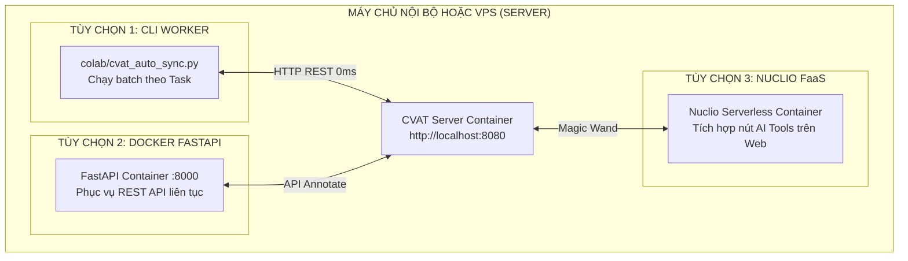

# 🖥️ HƯỚNG DẪN TRIỂN KHAI HỆ THỐNG TRÊN SERVER (SERVER DEPLOYMENT GUIDE)
> **Cẩm nang Triển khai Độc lập cho Locate-Anything AI Engine trên VPS, Máy chủ Linux, và Mạng Nội bộ (On-Premise)**  
> *Hỗ trợ: Ubuntu 20.04/22.04/24.04, Debian 11/12, CentOS/RHEL, Docker & NVIDIA GPU*

---

## 📌 MỤC LỤC
1. [Tổng Quan Kiến Trúc Khi Chạy Trên Server](#1-tổng-quan-kiến-trúc-khi-chạy-trên-server)
2. [Kịch Bản 1: Chạy CLI Auto-Sync Worker (Đơn Giản & Tối Ưu Nhất)](#2-kịch-bản-1-chạy-cli-auto-sync-worker-đơn-giản--tối-ưu-nhất)
   - [2.1. Cài đặt môi trường Python & Dependencies](#21-cài-đặt-môi-trường-python--dependencies)
   - [2.2. Lệnh thực thi đồng bộ Task](#22-lệnh-thực-thi-đồng-bộ-task)
   - [2.3. Cấu hình chạy nền liên tục với Systemd Service](#23-cấu-hình-chạy-nền-liên-tục-với-systemd-service)
3. [Kịch Bản 2: Đóng Gói Docker & Chạy FastAPI Microservice (Port 8000)](#3-kịch-bản-2-đóng-gói-docker--chạy-fastapi-microservice-port-8000)
   - [3.1. Triển khai 1-Click bằng Script tự động hóa](#31-triển-khai-1-click-bằng-script-tự-động-hóa)
   - [3.2. Tự Build & Chạy thủ công với Docker GPU / CPU](#32-tự-build--chạy-thủ-công-với-docker-gpu--cpu)
   - [3.3. Cấu hình Docker Compose chuẩn Server](#33-cấu-hình-docker-compose-chuẩn-server)
   - [3.4. Kiểm tra sức khỏe API & Reverse Proxy Nginx](#34-kiểm-tra-sức-khỏe-api--reverse-proxy-nginx)
4. [Kịch Bản 3: Tích Hợp Nuclio Serverless Vào Nút "AI Tools" Của CVAT](#4-kịch-bản-3-tích-hợp-nuclio-serverless-vào-nút-ai-tools-của-cvat)
   - [4.1. Cài đặt công cụ dòng lệnh nuctl](#41-cài-đặt-công-cụ-dòng-lệnh-nuctl)
   - [4.2. Triển khai Function với Timeout 180s](#42-triển-khai-function-với-timeout-180s)
5. [Kịch Bản 4: Tự Động Hóa Quét Task Định Kỳ (Autonomous Cronjob)](#5-kịch-bản-4-tự-động-hóa-quét-task-định-kỳ-autonomous-cronjob)
6. [Bảng Xử Lý Sự Cố Thường Gặp (Troubleshooting & FAQs)](#6-bảng-xử-lý-sự-cố-thường-gặp-troubleshooting--faqs)

---

## 1. Tổng Quan Kiến Trúc Khi Chạy Trên Server

So với việc chạy qua Google Colab, việc triển khai trực tiếp trên **Server riêng (VPS / On-Premise)** mang lại những lợi thế vượt trội:

- 🚀 **Tốc độ truyền dữ liệu siêu tốc**: Khi CVAT Server và AI Engine nằm trên cùng một máy (hoặc cùng mạng LAN), dữ liệu ảnh và nhãn truyền qua loopback nội bộ (`127.0.0.1`), **độ trễ bằng 0ms**, tải xong hàng trăm ảnh chỉ trong chớp mắt.
- 🛡️ **Bỏ qua hoàn toàn Cloudflare Tunnel**: Bạn không cần tạo tunnel trung gian ra ngoài Internet nữa, bảo mật tuyệt đối cho dữ liệu doanh nghiệp.
- ⏱️ **Hoạt động ổn định 24/7**: Không lo bị ngắt kết nối giữa chừng (như giới hạn 12h của Colab), có thể đặt lịch chạy tự động ban đêm.



---

## 2. Kịch Bản 1: Chạy CLI Auto-Sync Worker (Đơn Giản & Tối Ưu Nhất)

> **Mục đích**: Chạy lệnh terminal để tự động kéo ảnh từ một Task cụ thể, nạp vào GPU suy luận YOLOv11/SAM2, xuất đúng chuẩn Mask/Polygon/Box rồi ghi ngược lên CVAT.

### 2.1. Cài đặt môi trường Python & Dependencies

Trên máy chủ Linux (Ubuntu 20.04/22.04/24.04), thực hiện các lệnh sau:

```bash
# 1. Cập nhật hệ thống và cài đặt Python
sudo apt update && sudo apt install -y python3 python3-pip python3-venv git

# 2. Clone mã nguồn dự án
git clone https://github.com/Wanlee199/locate-anything.git
cd locate-anything

# 3. Tạo môi trường ảo (khuyên dùng để tránh xung đột thư viện)
python3 -m venv venv
source venv/bin/activate

# 4. Cài đặt các thư viện cần thiết
pip install --upgrade pip
pip install ultralytics pillow pyyaml
```

*(Nếu server có GPU NVIDIA, `ultralytics` sẽ tự động phát hiện CUDA và chạy bằng GPU. Nếu không có card rời, hệ thống sẽ tự động chuyển sang chế độ CPU Mode).*

---

### 2.2. Lệnh thực thi đồng bộ Task

Chạy script đồng bộ với thông tin Task trên CVAT:

```bash
python colab/cvat_auto_sync.py \
  --host http://localhost:8080 \
  --token <YOUR_CVAT_API_TOKEN> \
  --task-id 1
```

> 💡 **Mẹo**: Nếu CVAT Server của bạn nằm ở một máy chủ khác (ví dụ: `http://192.168.1.100:8080` hoặc domain `https://cvat.company.com`), chỉ cần thay đổi tham số `--host`.

**Đầu ra trên màn hình console:**
```text
=================================================================
🚀 BẮT ĐẦU ĐỒNG BỘ TỰ ĐỘNG SERVER <---> CVAT TASK #1
=================================================================
📦 Đang tải cấu hình nhãn từ: configs/labels_config.yaml
🧠 Đang khởi tạo Model Dispatcher (SAM 2.1 + YOLO + Pose)...
[INFO] Detector & Segmenter (yolo11n-seg.pt) da san sang tren: cuda
📋 Tên Task: Street Inspection
🏷️ Danh sách nhãn trong Task: ['car', 'bus', 'truck']
🖼️ Tổng số ảnh cần gán nhãn: 100
🎯 Mô hình AI sẽ gán nhãn cho 3 đối tượng chuẩn xác theo Task:
   • car          -> Chuẩn type: MASK     (Native Bitmap MASK - Brush RLE chuẩn CVAT)
   • bus          -> Chuẩn type: BOX      (2D Bounding Box - rectangle)
   • truck        -> Chuẩn type: BOX      (2D Bounding Box - rectangle)

  ⏳ Đang xử lý frame 100/100...
✅ Đã hoàn thành suy luận AI cho 100 ảnh! Tổng số shapes sinh ra: 412
📤 Đang đẩy toàn bộ nhãn lên CVAT Server...
=================================================================
🎉 THÀNH CÔNG! Đã gán nhãn và đồng bộ hoàn tất cho Task #1.
=================================================================
```

---

### 2.3. Cấu hình chạy nền liên tục với Systemd Service

Nếu bạn muốn tạo một tiến trình nền chạy liên tục hoặc xử lý các task lớn mà không sợ đứt kết nối SSH:

#### Cách 1: Dùng lệnh `nohup` (Nhanh gọn)
```bash
nohup python colab/cvat_auto_sync.py \
  --host http://localhost:8080 \
  --token <YOUR_TOKEN> \
  --task-id 1 > auto_sync.log 2>&1 &
```
Theo dõi log thời gian thực:
```bash
tail -f auto_sync.log
```

#### Cách 2: Tạo `systemd` service chuyên nghiệp
Tạo file dịch vụ tại `/etc/systemd/system/cvat-worker.service`:
```bash
sudo nano /etc/systemd/system/cvat-worker.service
```

Dán nội dung cấu hình sau:
```ini
[Unit]
Description=CVAT Auto Annotation Worker Service
After=network.target

[Service]
Type=simple
User=root
WorkingDirectory=/root/locate-anything
ExecStart=/root/locate-anything/venv/bin/python colab/cvat_auto_sync.py --host http://localhost:8080 --token YOUR_TOKEN --task-id 1
Restart=on-failure
RestartSec=10

[Install]
WantedBy=multi-user.target
```

Kích hoạt dịch vụ:
```bash
sudo systemctl daemon-reload
sudo systemctl enable cvat-worker
sudo systemctl start cvat-worker
sudo systemctl status cvat-worker
```

---

## 3. Kịch Bản 2: Đóng Gói Docker & Chạy FastAPI Microservice (Port 8000)

> **Mục đích**: Biến AI Engine thành một Web Service độc lập phục vụ API qua cổng `8000`, có thể tích hợp với các hệ thống backend khác hoặc Userscript trình duyệt.

### 3.1. Triển khai 1-Click bằng Script tự động hóa

Trong thư mục [`scripts/deploy_vps.sh`](scripts/deploy_vps.sh), hệ thống đã chuẩn bị sẵn script cài đặt trọn gói:

```bash
cd locate-anything
sudo bash scripts/deploy_vps.sh
```
Script sẽ tự động:
1. Cài đặt Docker Engine & Docker Compose chính thức.
2. Kiểm tra GPU và cài đặt **NVIDIA Container Toolkit**.
3. Khởi tạo container chạy nền trên cổng `8000`.

---

### 3.2. Tự Build & Chạy thủ công với Docker GPU / CPU

Nếu bạn muốn tự quản lý container qua Docker CLI:

```bash
# 1. Build Docker image từ Dockerfile có sẵn
docker build -t locate-anything-ai -f server/Dockerfile .

# 2. Khởi chạy container (nếu máy có GPU NVIDIA)
docker run -d \
  --name cvat_ai_service \
  --restart unless-stopped \
  --gpus all \
  -p 8000:8000 \
  locate-anything-ai

# 3. Khởi chạy container (nếu máy chỉ có CPU)
docker run -d \
  --name cvat_ai_service \
  --restart unless-stopped \
  -p 8000:8000 \
  locate-anything-ai
```

---

### 3.3. Cấu hình Docker Compose chuẩn Server

Tạo file `docker-compose.server.yml` để dễ dàng quản lý dừng/chạy:

```yaml
version: '3.8'

services:
  ai-engine:
    build:
      context: .
      dockerfile: server/Dockerfile
    image: locate-anything-ai:latest
    container_name: locate_ai_engine
    restart: unless-stopped
    ports:
      - "8000:8000"
    environment:
      - PYTHONUNBUFFERED=1
    deploy:
      resources:
        reservations:
          devices:
            - driver: nvidia
              count: all
              capabilities: [gpu]
```

Khởi chạy bằng lệnh:
```bash
docker compose -f docker-compose.server.yml up -d
```

---

### 3.4. Kiểm tra sức khỏe API & Reverse Proxy Nginx

Kiểm tra API đã sẵn sàng:
```bash
curl http://localhost:8000/health
```

Kết quả phản hồi JSON:
```json
{
  "status": "healthy",
  "service": "CVAT Universal AI Engine",
  "cuda_available": true,
  "gpu_device": "NVIDIA GeForce RTX 4090",
  "total_labels": 6
}
```

#### Cấu hình Nginx Reverse Proxy (Có tên miền & SSL HTTPS):
Nếu bạn muốn mở API ra ngoài Internet qua domain riêng (VD: `ai.yourdomain.com`):
```nginx
server {
    server_name ai.yourdomain.com;

    location / {
        proxy_pass http://127.0.0.1:8000;
        proxy_set_header Host $host;
        proxy_set_header X-Real-IP $remote_addr;
        proxy_read_timeout 300s;
        proxy_connect_timeout 300s;
    }
}
```

---

## 4. Kịch Bản 3: Tích Hợp Nuclio Serverless Vào Nút "AI Tools" Của CVAT

> **Mục đích**: Cho phép annotator bấm trực tiếp vào biểu tượng **Chiếc đũa thần (Magic Wand / AI Tools)** trên giao diện web của CVAT để AI tự động vẽ.

### 4.1. Cài đặt công cụ dòng lệnh `nuctl`

Trên máy chủ Linux đã cài CVAT:
```bash
curl -s https://api.github.com/repos/nuclio/nuclio/releases/latest \
  | grep -i "browser_download_url.*nuctl.*linux-amd64" \
  | cut -d : -f 2,3 \
  | tr -d \" \
  | wget -qi - -O nuctl && chmod +x nuctl && sudo mv nuctl /usr/local/bin/
```

### 4.2. Triển khai Function với Timeout 180s

Trong thư mục [`server/nuclio/`](server/nuclio/) đã có sẵn `function.yaml` cấu hình sẵn thông số `eventTimeout: 180s` (chống lỗi 504 Gateway Timeout):

```bash
cd locate-anything

nuctl deploy --project-name cvat \
  --path server/nuclio \
  --file server/nuclio/function.yaml \
  --platform local
```

Sau khi deploy thành công:
1. Mở bất kỳ Task nào trên giao diện CVAT Web.
2. Nhìn sang thanh công cụ bên trái $\rightarrow$ Click vào biểu tượng **AI Tools (Magic Wand)**.
3. Chọn model của dự án $\rightarrow$ Click chuột lên vật thể để AI tự động sinh viền Mask/Polygon bám khít!

---

## 5. Kịch Bản 4: Tự Động Hóa Quét Task Định Kỳ (Autonomous Cronjob)

Nếu bạn có quy trình tải ảnh lên CVAT liên tục và muốn hệ thống **cứ 30 phút tự động quét các Task mới để gán nhãn AI**:

Tạo script `auto_run_all.sh`:
```bash
#!/usr/bin/env bash
CVAT_HOST="http://localhost:8080"
TOKEN="YOUR_API_TOKEN"

# Lấy danh sách ID các task có trạng thái 'annotation'
TASK_IDS=$(curl -s -H "Authorization: Bearer $TOKEN" "$CVAT_HOST/api/tasks?status=annotation" \
  | grep -o '"id":[0-9]*' | cut -d: -f2)

for ID in $TASK_IDS; do
  echo "Đang xử lý tự động cho Task #$ID..."
  python colab/cvat_auto_sync.py --host $CVAT_HOST --token $TOKEN --task-id $ID
done
```

Đặt lịch Cronjob chạy mỗi 30 phút:
```bash
crontab -e
# Thêm dòng:
*/30 * * * * /bin/bash /root/locate-anything/auto_run_all.sh >> /var/log/cvat_cron.log 2>&1
```

---

## 6. Bảng Xử Lý Sự Cố Thường Gặp (Troubleshooting & FAQs)

| Lỗi gặp phải | Nguyên nhân | Cách khắc phục |
| :--- | :--- | :--- |
| **`HTTP 401 Unauthorized`** | Gửi token sai định dạng (ví dụ `Token xxx` thay vì `Bearer xxx`). | Đảm bảo header sử dụng đúng tiền tố: `"Authorization": "Bearer <token>"`. |
| **`CUDA out of memory`** | Ảnh độ phân giải quá cao hoặc VRAM GPU bị đầy bởi tiến trình khác. | Trong lệnh gọi model, thêm tham số giảm kích thước ảnh: `model.predict(..., imgsz=1280)`. |
| **`Docker: could not select device driver with capabilities: [[gpu]]`** | Docker chưa nhận diện card NVIDIA. | Cài đặt gói `nvidia-container-toolkit` và restart docker: `sudo systemctl restart docker`. |
| **`Address already in use: 8000`** | Cổng 8000 đang bị một tiến trình khác chiếm dụng. | Kiểm tra tiến trình bằng `sudo lsof -i :8000` hoặc đổi sang cổng khác (VD: `8001:8000`). |
| **`invalid length for shape type 'mask'`** | Tự viết code gửi mảng vector vào nhãn `type: mask`. | Sử dụng module [`locate_cvat/rle_utils.py`](locate_cvat/rle_utils.py) để tự động nén RLE theo đúng chuẩn CVAT. |

---

> 📖 **Tài liệu tham khảo liên quan**:
> - Tài liệu kiến trúc toàn diện: [`SYSTEM_DOCUMENTATION.md`](SYSTEM_DOCUMENTATION.md)
> - Hướng dẫn gán nhãn đa hình thái: [`docs/label_configuration_guide.md`](docs/label_configuration_guide.md)
> - Kế hoạch nâng cấp phiên bản V2: [`ROADMAP_V2.md`](ROADMAP_V2.md)
