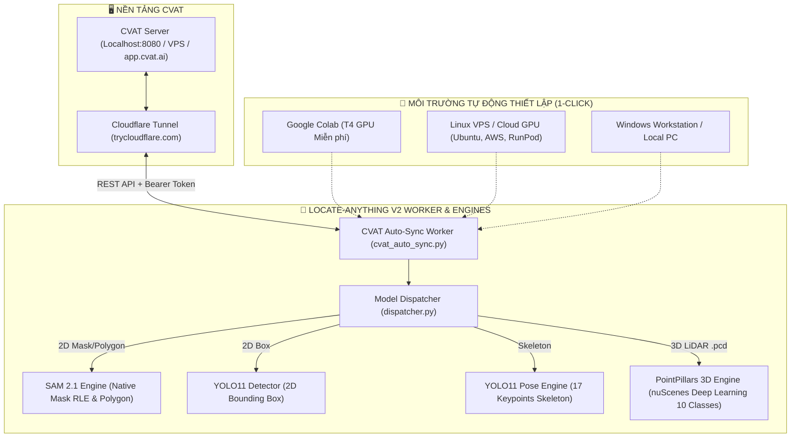

# 📘 TÀI LIỆU TỔNG HỢP TOÀN DIỆN HỆ THỐNG LOCATE-ANYTHING (V2)
### Hệ Thống Tự Động Hóa Gán Nhãn Đa Hình Thái 2D/3D Cho CVAT & Nền Tảng Triển Khai Mọi Server

---

## 📑 MỤC LỤC
1. [Tổng Quan Kiến Trúc Hệ Thống](#1-tổng-quan-kiến-trúc-hệ-thống)
2. [Chi Tiết AI Engine 3D LiDAR (nuScenes PointPillars Deep Learning)](#2-chi-tiết-ai-engine-3d-lidar-nuscenes-pointpillars-deep-learning)
3. [Chi Tiết AI Engine 2D Vision & Đa Hình Thái](#3-chi-tiết-ai-engine-2d-vision--đa-hình-thái)
4. [Hướng Dẫn Triển Khai 1-Click Trên Bất Kỳ Google Colab Nào](#4-hướng-dẫn-triển-khai-1-click-trên-bất-kỳ-google-colab-nào)
5. [Hướng Dẫn Triển Khai & Cập Nhật Tự Động Trên Mọi Server Linux/VPS](#5-hướng-dẫn-triển-khai--cập-nhật-tự-động-trên-mọi-server-linuxvps)
6. [Hướng Dẫn Triển Khai Trên Windows Server / Máy Cá Nhân](#6-hướng-dẫn-triển-khai-trên-windows-server--máy-cá-nhân)
7. [Bảng So Sánh Kỹ Thuật (Trước & Sau Khi Nâng Cấp)](#7-bảng-so-sánh-kỹ-thuật-trước--sau-khi-nâng-cấp)
8. [Sổ Tay Xử Lý Lỗi & Câu Hỏi Thường Gặp (Troubleshooting & FAQs)](#8-sổ-tay-xử-lý-lỗi--câu-hỏi-thường-gặp-troubleshooting--faqs)

---

## 1. TỔNG QUAN KIẾN TRÚC HỆ THỐNG

### 🎯 Mục tiêu dự án
Hệ thống **locate-anything (V2)** giải quyết trọn vẹn 3 bài toán lớn nhất trong quy trình gán nhãn dữ liệu học máy:
1. **Tự động gán nhãn tốc độ cao**: Hỗ trợ đầy đủ từ ảnh 2D thông thường đến dữ liệu đám mây điểm 3D LiDAR (`.pcd`, `.bin`).
2. **Triển khai tự do, độc lập**: Tách rời hoàn toàn khỏi hạ tầng microservice cồng kềnh của CVAT Nuclio; cho phép tận dụng GPU miễn phí trên Google Colab hoặc bất kỳ máy chủ Linux VPS/Cloud GPU nào.
3. **Độc lập từng Job / Task**: Cho phép annotator chạy AI tự động gán nhãn cho đúng Job được phân công mà không làm ảnh hưởng hay ghi đè bài làm của người khác trong cùng Task.

### 📐 Sơ đồ kiến trúc luồng dữ liệu (Architecture Flow)



---

## 2. CHI TIẾT AI ENGINE 3D LIDAR (NUSCENES POINTPILLARS DEEP LEARNING)

### 2.1. Cấu hình mô hình Deep Learning
- **Kiến trúc mạng**: **PointPillars** (OpenPCDet CBGS Multi-Head).
- **Tập dữ liệu huấn luyện**: **nuScenes Full Dataset** (chuẩn Benchmark xe tự hành cao cấp nhất hiện nay).
- **Trọng số Pretrained**: `cbgs_pp_multihead_nds58.pth` (kích thước nén chỉ 23.3 MB, tải tự động từ Google Drive ID `1p-501mTWsq0G9RzroTWSXreIMyTUUpBM`).
- **Phạm vi tọa độ quét hiệu dụng**:
  - $X \in [-51.2, 51.2]$ mét (trục dọc trước/sau xe).
  - $Y \in [-51.2, 51.2]$ mét (trục ngang trái/phải xe).
  - $Z \in [-5.0, 3.0]$ mét (trục cao độ mặt đất đến nóc vật thể).

### 2.2. Danh mục 10 lớp vật thể nuScenes và cơ chế ánh xạ thông minh
Mô hình tự động phát hiện 10 nhóm đối tượng tiêu chuẩn:
1. `car` (Xe ô tô con)
2. `truck` (Xe tải)
3. `bus` (Xe buýt, xe khách)
4. `trailer` (Rơ-moóc)
5. `construction_vehicle` (Xe công trình, xe cẩu, xe ủi)
6. `pedestrian` (Người đi bộ)
7. `motorcycle` (Xe máy, mô tô)
8. `bicycle` (Xe đạp)
9. `barrier` (Rào chắn an toàn, dải phân cách)
10. `traffic_cone` (Cọc tiêu giao thông hình nón)

> [!TIP]
> **Cơ chế Auto-Mapping**: Khi Task trên CVAT chỉ có nhãn chung là `vehicles`, mô hình tự động gộp các phát hiện thuộc nhóm phương tiện (`car`, `truck`, `bus`, `trailer`, `construction_vehicle`) về nhãn `vehicles` của Task! Tương tự, các nhãn có đuôi `_3d` như `car_3d` cũng được nhận diện chính xác.

### 2.3. Định dạng Payload 3D chuẩn xác của CVAT Canvas (Quy tắc 16 phần tử)
CVAT Canvas 3D (`cvat-canvas3dView.ts`) yêu cầu mảng `points` bắt buộc phải có đúng **16 phần tử số thực**, gồm:
```python
points = [
    x, y, z,        # Tọa độ tâm hộp 3D (3 phần tử)
    rx, ry, rz,     # Góc xoay Euler theo radian (3 phần tử, thường quay quanh trục z)
    dx, dy, dz,     # Kích thước hộp: chiều dài, chiều rộng, chiều cao (3 phần tử)
    0.0, 0.0, 0.0,  # 7 số 0 đệm theo chuẩn định dạng CVAT
    0.0, 0.0, 0.0, 0.0
]
```
Đồng thời trường `rotation` cấp root của shape 3D được đặt mặc định `0.0` để tương thích hoàn toàn với schema của CVAT Backend (tránh lỗi HTTP 400 Bad Request).

---

## 3. CHI TIẾT AI ENGINE 2D VISION & ĐA HÌNH THÁI

Hệ thống tự động tra cứu loại hình dạng (`type`) quy định trên Task CVAT để gọi mô hình chuyên trách:

| Định dạng CVAT | AI Engine Thực Thi | Mô tả kỹ thuật |
| :--- | :--- | :--- |
| **`mask`** | **Ultralytics SAM 2.1** | Sinh ra mảng **Brush RLE điểm ảnh nguyên bản**. Annotator vào CVAT có thể cầm bút tẩy/vẽ thêm trực tiếp. |
| **`polygon`** | **YOLO11 Segmenter** | Sinh ra đa giác viền khít với các điểm neo (anchor points) kéo thả được. |
| **`rectangle` / `box`**| **YOLO11 Detector** | Phát hiện nhanh bounding box 2D với tọa độ `[xtl, ytl, xbr, ybr]`. |
| **`skeleton`** | **YOLO11 Pose** | Phát hiện dáng người với **17 khớp xương COCO** kết nối dạng đồ thị cạnh (`nodes` & `edges`). |
| **`polyline` / `line`** | **Locate Thinning Engine** | Trích xuất xương dải đường thành đường tim đường. |
| **`ellipse`** | **Direct Least Squares Fitting** | Fit phương trình đường cong elip toán học: tâm `(cx, cy)` và bán kính `(rx, ry)`. |
| **`tag`** | **Classification Adapter** | Gán nhãn phân loại toàn ảnh (Tag-level). |

---

## 4. HƯỚNG DẪN TRIỂN KHAI 1-CLICK TRÊN BẤT KỲ GOOGLE COLAB NÀO

File notebook: [colab/launch_colab.ipynb](file:///d:/QuanProject/locate-anything/colab/launch_colab.ipynb)

[](https://colab.research.google.com/github/Wanlee199/locate-anything/blob/locateV2/colab/launch_colab.ipynb)

### Bước 1: Chuẩn bị trên máy tính (nếu dùng CVAT Localhost)
Nếu bạn chạy CVAT trên máy cá nhân (`http://localhost:8080`), hãy mở một cửa sổ terminal và chạy Cloudflare Tunnel để tạo đường link HTTPS công khai cho Colab kết nối về:
```bash
.\cloudflared.exe tunnel --url http://localhost:8080 --http-host-header localhost:8080
```
Copy đường dẫn hiển thị trên terminal (dạng `https://xxxx-xxxx.trycloudflare.com`).

### Bước 2: Thao tác trên Google Colab
1. Mở file [colab/launch_colab.ipynb](file:///d:/QuanProject/locate-anything/colab/launch_colab.ipynb) trên Google Colab.
2. Kiểm tra GPU: Menu **Runtime** $\rightarrow$ **Change runtime type** $\rightarrow$ Chọn **T4 GPU** $\rightarrow$ Bấm **Save**.
3. **Bấm chạy BƯỚC 1 (1-Click Setup)**:
   - Cell sẽ tự kiểm tra GPU.
   - Tự động kiểm tra: nếu chưa có thì `git clone`, nếu đã có thì `git pull origin locateV2` (bảo toàn trọng số đã tải).
   - Tự động cài đặt `requirements.txt` và chạy `tools/setup_3d_model.py --install` để tải weights nuScenes 23MB và cấu hình `spconv` + `OpenPCDet`.
4. **Bấm chạy BƯỚC 2 (Gán nhãn tự động)**:
   - Nhập thông số vào giao diện Form:
     - `CVAT_HOST`: Dán đường link Cloudflare tunnel hoặc link VPS.
     - `CVAT_TOKEN`: Dán API Token lấy từ CVAT Web (Avatar góc phải trên $\rightarrow$ Profile $\rightarrow$ API Tokens).
     - `CVAT_JOB_ID`: Điền ID của Job cần gán nhãn (VD: `2`).
     - `CONFIDENCE_THRESHOLD`: Kéo thanh trượt điều chỉnh độ nhạy AI (mặc định `0.25`).
     - `CLEAR_OLD_ANNOTATIONS`: Chọn `True` (xóa nhãn rác cũ trước khi nạp nhãn mới).
   - Bấm nút Play cell $\rightarrow$ AI quét dữ liệu, phân tích và đẩy thẳng nhãn lên CVAT!

---

## 5. HƯỚNG DẪN TRIỂN KHAI & CẬP NHẬT TỰ ĐỘNG TRÊN MỌI SERVER LINUX/VPS

File quản lý tập trung: [scripts/deploy_server.sh](file:///d:/QuanProject/locate-anything/scripts/deploy_server.sh)

Hỗ trợ mọi máy chủ: **Ubuntu 20.04/22.04/24.04, Debian, AWS EC2, GCP, RunPod, LambdaLabs, Hetzner, Vultr**.

### 5.1. Cài đặt tự động lần đầu (1 Lệnh duy nhất)
```bash
git clone -b locateV2 https://github.com/Wanlee199/locate-anything.git
cd locate-anything
bash scripts/deploy_server.sh --install
```
*Script sẽ tự động:*
- Khởi tạo Python virtual environment độc lập (`.venv`).
- Kiểm tra card đồ họa NVIDIA và phiên bản driver (`nvidia-smi`).
- Cài đặt toàn bộ dependencies từ [requirements.txt](file:///d:/QuanProject/locate-anything/requirements.txt).
- Cài đặt `spconv`, `OpenPCDet` và tải weights nuScenes PointPillars.
- Chạy bộ 24 test kiểm thử tự động xác nhận hệ thống hoạt động 100%.

### 5.2. Cập nhật mã nguồn mới nhất (Zero Downtime)
Khi có tính năng mới được commit lên GitHub, bạn chỉ cần gõ 1 lệnh trên server:
```bash
bash scripts/deploy_server.sh --update
```
*Script sẽ tự động kéo code mới nhất từ nhánh `locateV2`, cập nhật thư viện bổ sung nếu có và kiểm tra lại trọng số mô hình.*

### 5.3. Các chế độ thực thi
- **Chạy gán nhãn 1 lần theo Job**:
  ```bash
  bash scripts/deploy_server.sh --sync --host "https://filme-casting-charlotte-machine.trycloudflare.com" --token "WMkKguaq..." --job-id 2
  ```
- **Chạy dịch vụ nền liên tục (Daemon Mode)**:
  ```bash
  bash scripts/deploy_server.sh --daemon --host "https://filme-casting-charlotte-machine.trycloudflare.com" --token "WMkKguaq..." --job-id 2 --poll-interval 30
  ```
- **Kiểm tra trạng thái phần cứng và phiên bản code**:
  ```bash
  bash scripts/deploy_server.sh --status
  ```
- **Chạy kiểm thử đơn vị**:
  ```bash
  bash scripts/deploy_server.sh --test
  ```

---

## 6. HƯỚNG DẪN TRIỂN KHAI TRÊN WINDOWS SERVER / MÁY CÁ NHÂN

File quản lý tập trung: [scripts/deploy_server.bat](file:///d:/QuanProject/locate-anything/scripts/deploy_server.bat)

| Tác vụ | Lệnh thực thi trong Windows Command Prompt (cmd) |
| :--- | :--- |
| **Cài đặt thư viện & weights** | `scripts\deploy_server.bat install` |
| **Cập nhật code mới từ Git** | `scripts\deploy_server.bat update` |
| **Kiểm tra trạng thái hệ thống** | `scripts\deploy_server.bat status` |
| **Chạy gán nhãn Job** | `scripts\deploy_server.bat sync --host "URL" --token "TOKEN" --job-id 2` |
| **Chạy bộ kiểm thử** | `scripts\deploy_server.bat test` |

---

## 7. BẢNG SO SÁNH KỸ THUẬT (TRƯỚC & SAU KHI NÂNG CẤP)

| Tiêu chí kỹ thuật | Trước Khi Nâng Cấp | Sau Khi Nâng Cấp (locateV2) |
| :--- | :--- | :--- |
| **Thuật toán 3D LiDAR** | DBSCAN Clustering + PCA (Hình học thuần túy, nhiều hộp rác) | **OpenPCDet PointPillars Deep Learning** (Huấn luyện trên tập nuScenes, hộp ôm khít xe) |
| **Số lượng nhãn 3D** | 1 nhãn giả lập duy nhất | **10 lớp vật thể nuScenes tiêu chuẩn** + tự động gộp nhóm `vehicles` |
| **Tính tương thích CVAT 3D** | Lỗi HTTP 400 Bad Request do sai định dạng góc xoay | **Chuẩn Payload 16-point**, tương thích 100% với Canvas 3D CVAT |
| **Triển khai trên Colab** | Phải xóa thư mục và clone lại từ đầu, dễ mất weights | **1-Click Auto Clone/Pull**, bảo toàn weights 23MB giữa các lần chạy |
| **Giao diện người dùng Colab**| Sửa code Python thủ công | **Interactive Form (`#@param`)** với thanh trượt và ô nhập trực quan |
| **Thông báo lỗi mạng / CVAT** | Traceback Python urllib dài dòng khó hiểu | **Thông báo tiếng Việt thân thiện** kèm hướng dẫn sửa lỗi ngay lập tức |
| **Quản trị đa Server** | Không có công cụ chuẩn | Bộ script toàn diện **`deploy_server.sh`** và **`deploy_server.bat`** |
| **Độ phủ kiểm thử** | Chưa có kiểm thử 3D | **24/24 unit tests tự động**, thời gian chạy dưới 1 giây |

---

## 8. SỔ TAY XỬ LÝ LỖI & CÂU HỎI THƯỜNG GẶP (TROUBLESHOOTING & FAQS)

### Q1: Colab báo lỗi: "❌ Lỗi xác thực CVAT (HTTP 401 hoặc 403)"
- **Nguyên nhân**: Token API chưa được cấp quyền hoặc đã hết hạn hoặc bạn copy thiếu ký tự.
- **Cách khắc phục**:
  1. Đăng nhập vào giao diện web CVAT.
  2. Bấm vào ảnh đại diện cá nhân ở góc trên bên phải $\rightarrow$ Chọn **Profile**.
  3. Bấm vào tab **API Tokens** $\rightarrow$ Chọn **Create** $\rightarrow$ Copy mã Token mới tạo và dán lại vào form của Colab.

### Q2: Colab báo lỗi: "❌ Không thể kết nối tới máy chủ CVAT tại https://...trycloudflare.com"
- **Nguyên nhân**: Lệnh `cloudflared.exe` trên máy tính cá nhân bị tắt, hoặc đường link tunnel đã thay đổi sau khi khởi động lại.
- **Cách khắc phục**:
  1. Kiểm tra cửa sổ terminal đang chạy `cloudflared.exe` trên máy tính.
  2. Đảm bảo CVAT trên máy tính (`http://localhost:8080`) đang mở bình thường.
  3. Copy lại đường link tunnel mới nhất và dán vào form trên Colab.

### Q3: Muốn gán nhãn cả Task thay vì chỉ 1 Job thì làm thế nào?
- **Cách thực hiện**:
  1. Trong form Colab, đặt `CVAT_JOB_ID = 0`.
  2. Nhập ID của Task vào ô `CVAT_TASK_ID` (ví dụ: `2`).
  3. Bấm chạy cell: hệ thống sẽ tự động quét và gán nhãn cho toàn bộ các frame trong tất cả các Job của Task đó!

### Q4: Muốn chạy thử trước vài frame để xem kết quả trước khi chạy cả nghìn frame?
- **Cách thực hiện**:
  - Trong form Colab, đặt `MAX_FRAMES_TEST = 5`.
  - Hệ thống sẽ chỉ quét và vẽ nhãn cho đúng 5 frame đầu tiên để bạn kiểm tra trên trình duyệt! Khi hài lòng, đặt lại về `0` để chạy toàn bộ.

---
*Tài liệu được biên soạn tự động và cập nhật theo phiên bản nhánh `locateV2`.*
